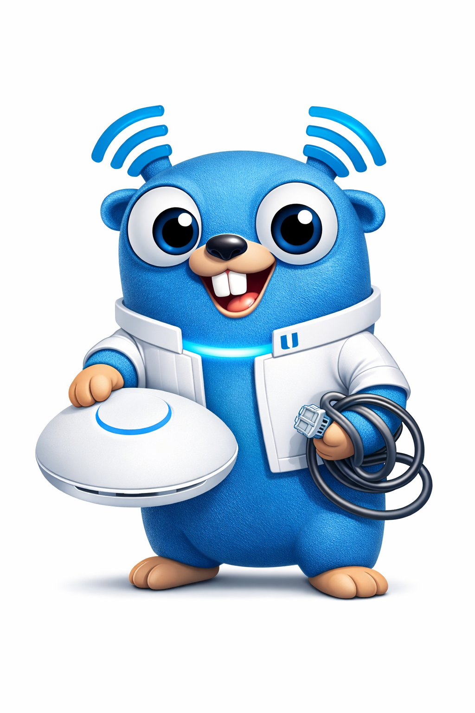

# gofi

<p align="center">
  
</p>

<p align="center">
  <strong>This project is a work in progress and is AI-generated.</strong>
</p>

---

A Go module for programmatic control of UniFi UDM Pro devices (v10+).

## Overview

gofi provides a comprehensive Go client library for interacting with Ubiquiti UniFi Dream Machine Pro controllers. It offers type-safe access to the UniFi Network API, enabling automation of network management tasks.

## Features

- **Full API Coverage** - Support for sites, devices, networks, WLANs, firewall rules, clients, users, routing, and system operations
- **Type-Safe** - Strongly typed Go structs for all API resources with flexible JSON handling
- **WebSocket Events** - Real-time event streaming for network changes
- **Concurrent-Safe** - Thread-safe CSRF token handling and session management
- **Mock Server** - Built-in mock server for testing without real hardware
- **v1 and v2 API Support** - Compatible with both legacy and modern UniFi API endpoints

## Installation

```bash
go get github.com/[org]/gofi
```

## Quick Start

```go
package main

import (
    "context"
    "fmt"
    "log"

    "github.com/[org]/gofi"
)

func main() {
    // Create a new client
    client, err := gofi.New(&gofi.Config{
        Host:     "192.168.1.1",
        Username: "admin",
        Password: "password",
        Site:     "default",
    })
    if err != nil {
        log.Fatal(err)
    }

    ctx := context.Background()

    // Connect to the controller
    if err := client.Connect(ctx); err != nil {
        log.Fatal(err)
    }
    defer client.Disconnect(ctx)

    // List all devices
    devices, err := client.Devices().List(ctx, "default")
    if err != nil {
        log.Fatal(err)
    }

    for _, device := range devices {
        fmt.Printf("Device: %s (%s)\n", device.Name, device.MAC)
    }
}
```

## API Overview

### Services

| Service | Description |
|---------|-------------|
| `Sites()` | Site management and health monitoring |
| `Devices()` | Device adoption, provisioning, and control |
| `Networks()` | Network/VLAN configuration |
| `WLANs()` | Wireless network management |
| `Firewall()` | Firewall rules and traffic policies |
| `Clients()` | Connected client operations |
| `Users()` | Known client/user management |
| `Routing()` | Static route configuration |
| `PortForwards()` | Port forwarding rules |
| `Settings()` | Controller settings |
| `System()` | System operations (backup, reboot, etc.) |
| `Events()` | WebSocket event streaming |

### Authentication

gofi uses cookie-based session authentication with automatic CSRF token management:

```go
client, _ := gofi.New(&gofi.Config{
    Host:     "192.168.1.1",
    Username: "admin",
    Password: "password",
})

// Connect handles login and CSRF token extraction
client.Connect(ctx)
```

### Error Handling

```go
devices, err := client.Devices().List(ctx, "default")
if err != nil {
    switch {
    case errors.Is(err, gofi.ErrAuthenticationFailed):
        // Handle auth failure
    case errors.Is(err, gofi.ErrNotFound):
        // Handle not found
    case errors.Is(err, gofi.ErrRateLimited):
        // Handle rate limiting
    default:
        // Handle other errors
    }
}
```

### WebSocket Events

```go
events, err := client.Events().Subscribe(ctx, "default")
if err != nil {
    log.Fatal(err)
}

for event := range events {
    switch event.Type {
    case gofi.EventClientConnected:
        fmt.Printf("Client connected: %s\n", event.Data)
    case gofi.EventDeviceUpdated:
        fmt.Printf("Device updated: %s\n", event.Data)
    }
}
```

## Technical Details

- **Base Path**: UDM Pro uses `/proxy/network` prefix for all API calls
- **API Versions**: Supports both v1 (`/api/s/{site}/...`) and v2 (`/v2/api/site/{site}/...`) endpoints
- **TLS**: Requires TLS; self-signed certificates are common on UDM devices
- **WebSocket**: Events available at `wss://{host}/proxy/network/wss/s/{site}/events`

## Development

### Prerequisites

- Go 1.21+
- Make

### Commands

```bash
make build     # Build the module
make test      # Run all tests
make lint      # Run linter
make coverage  # Generate coverage report
```

### Testing

All tests use the built-in mock server - no real UDM hardware required:

```go
func TestDeviceList(t *testing.T) {
    server := mock.NewServer()
    defer server.Close()

    client, _ := gofi.New(&gofi.Config{
        Host: server.Host(),
    })

    // Tests run against the mock server
}
```

## Project Structure

```
gofi/
├── client.go          # Main client, authentication, request handling
├── types.go           # All domain types (Device, Network, WLAN, etc.)
├── errors.go          # Sentinel errors, APIError type
├── services/          # Service implementations
│   ├── site.go
│   ├── device.go
│   ├── network.go
│   └── ...
├── mock/              # Mock server for testing
│   ├── server.go
│   ├── handlers.go
│   └── fixtures/
└── examples/          # Usage examples
```

## Documentation

- [API Reference](docs/UNIFI_UDM_PRO_API_DOCUMENTATION.md) - Complete endpoint documentation
- [Design Document](docs/DESIGN.md) - Architecture and design decisions
- [Implementation Plan](docs/plan.md) - Phased development plan

## Contributing

Contributions are welcome! Please ensure:

1. All new functions have corresponding tests
2. All endpoints are supported in the mock server
3. Tests pass with `make test`
4. Code passes linting with `make lint`

## License

MIT License - see [LICENSE](LICENSE) for details.

## Acknowledgments

This project draws inspiration from:

- [go-unifi](https://github.com/paultyng/go-unifi) - Terraform provider patterns
- [unpoller/unifi](https://github.com/unpoller/unifi) - FlexInt/FlexBool types
- [unifi-client](https://github.com/thib3113/unifi-client) - TypeScript implementation
