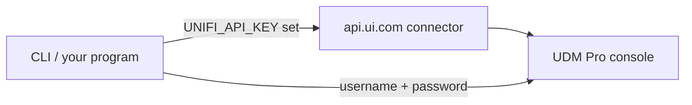

# gofi - Go UniFi Controller Client

[](https://pkg.go.dev/github.com/unifi-go/gofi/src)
[](https://goreportcard.com/report/github.com/unifi-go/gofi)

Programmatic control of Ubiquiti UniFi UDM Pro devices. This repository is two things:

- **Command-line program** — a unified tool (`gofi`) with subcommands for managing fixed IPs,
  listing clients, inspecting networks, and more.
- **A Go module (SDK)** — a type-safe, concurrent-safe client library you can import into
  your own programs.

If you just want to get work done from the shell, start with **[Part 1: Command-line
programs](#part-1-command-line-programs)**. If you're writing Go code against a UniFi
controller, jump to **[Part 2: Using gofi in your Go program](#part-2-using-gofi-in-your-go-program-sdk)**.

---

# Part 1: Command-line programs

## Step 1 — Get a UniFi API key (recommended)

gofi supports two ways to authenticate. A **cloud API key** used through Ubiquiti's Site
Manager connector is the recommended one: it works even when the controller isn't directly
reachable on your LAN, needs no session cookies, and is the preferred authentication method.

**Create the key:**

1. Sign in at [unifi.ui.com](https://unifi.ui.com) using a **Site Admin** or **Owner**
   account. A key inherits the permissions of the account that created it.
2. Go to your **profile icon → API → Create API Key**.
3. Grant it the **UniFi Applications → Network** scope.

> Cloud keys (from unifi.ui.com) are a different credential from console-issued keys (from
> the console's own UI). Connector access requires the **cloud** key.

**Find your console ID** (the connector needs it):

```bash
export UNIFI_API_KEY=...    # the key you just created
curl -s -H "X-API-KEY: $UNIFI_API_KEY" https://api.ui.com/v1/hosts
```

**Export both values** so the programs can find them:

```bash
export UNIFI_API_KEY=...
export UNIFI_CONSOLE_ID=...
```

That's it — every request now goes to `https://api.ui.com`, which forwards it to your
console. No direct network route to the UDM is required.

### Alternative — local username/password

If the controller is directly reachable and you'd rather use admin credentials, set these
instead:

```bash
export UNIFI_USERNAME=admin
export UNIFI_PASSWORD=your-password
export UNIFI_CONTROLLER_IP=192.168.1.1   # optional; used when -H is not given
```

This uses the original cookie/CSRF session flow against the controller. It is fully
supported and kicks in automatically whenever `UNIFI_API_KEY` is not set.


```mermaid
flowchart LR
    A[CLI / your program] -->|UNIFI_API_KEY set| B[api.ui.com connector]
    B --> C[UDM Pro console]
    A -->|username + password| C
```

## Step 2 — Build and install the programs

```bash
make install        # build the utilities and install them to ~/bin
make utilities      # or just build them into ./bin
make examples       # build the example programs into ./bin/examples
```

`make install` puts `gofi` on your `PATH` (override the destination with `make install INSTALL_DIR=/somewhere/else`).

## Step 3 — Shell completion (optional)

`gofi completion <shell>` doesn't configure anything by itself — it prints a completion
script to stdout. What you do with that output determines whether completion is
temporary (this shell session only) or permanent (every new shell).

**Try it first, without installing anything:**

```bash
source <(gofi completion bash)   # bash
gofi completion zsh | source     # zsh (as a one-off; see below for the real setup)
```

Completion works for this shell session only; open a new terminal and it's gone. Use
this to confirm completion behaves the way you want before wiring it in permanently.

**Install permanently:**

<details>
<summary>bash</summary>

Requires the `bash-completion` package (`apt install bash-completion`, `brew install
bash-completion`, etc.) — without it, sourced completion scripts are silently ignored.

System-wide (needs root, affects every user):

```bash
gofi completion bash | sudo tee /etc/bash_completion.d/gofi > /dev/null
```

Per-user, no root required:

```bash
mkdir -p ~/.local/share/bash-completion/completions
gofi completion bash > ~/.local/share/bash-completion/completions/gofi
```

Restart your shell, or `source` the file directly, to pick it up.

</details>

<details>
<summary>zsh</summary>

Pick a directory already on your `fpath` (check with `echo $fpath`), or add one:

```bash
mkdir -p ~/.zsh/completions
gofi completion zsh > ~/.zsh/completions/_gofi
```

Then, in `~/.zshrc`, before the `compinit` line:

```zsh
fpath=(~/.zsh/completions $fpath)
autoload -Uz compinit && compinit
```

If you use a framework (oh-my-zsh, prezto), drop `_gofi` into its custom completions
directory instead (e.g. `~/.oh-my-zsh/custom/completions/`) and skip the `fpath` edit.

Restart your shell after making this change — `zsh` only rebuilds its completion cache
on `compinit`.

</details>

<details>
<summary>fish</summary>

```fish
gofi completion fish > ~/.config/fish/completions/gofi.fish
```

Picked up automatically in new fish sessions — no restart-triggering config edit needed.

</details>

<details>
<summary>powershell</summary>

```powershell
gofi completion powershell | Out-String | Invoke-Expression
```

To make this permanent, add that line to your PowerShell profile (`$PROFILE`).

</details>

Once installed, `gofi <TAB>` lists areas, `gofi ips <TAB>` lists actions, and
`gofi ips add --<TAB>` lists flags. Flag *values* (router names, MAC addresses, bands)
don't complete — only the command and flag names themselves.

## Migrating from the old tools

`gofips`, `gofimac`, `gofinet`, `gofidns`, and `gofiuser` are replaced by one binary,
`gofi`, as of this release. There are no wrapper binaries; update any script or cron
job using the table below.

| Old command | New command |
|---|---|
| `gofips -H <host> -k -g` | `gofi -H <host> --secure ips export` |
| `gofips -H <host> -k -s <file>` | `gofi -H <host> --secure ips import <file>` |
| `gofips -H <host> -k -a '<declaration>'` | `gofi -H <host> --secure ips add '<declaration>'` |
| `gofips -H <host> -k -d -n <name>` | `gofi -H <host> --secure ips rm --name <name>` |
| `gofips -H <host> -k -d -m <mac>` | `gofi -H <host> --secure ips rm --mac <mac>` |
| `gofimac -H <host> -k --wifi` | `gofi -H <host> --secure clients list --wifi` |
| `gofimac -H <host> -k --wired -j` | `gofi -H <host> --secure --output json clients list --wired` |
| `gofinet -H <host> -k` | `gofi -H <host> --secure network list` |
| `gofidns -H <host> -k -g` | `gofi -H <host> --secure dns list` |
| `gofidns -H <host> -k -d -n <name>` | `gofi -H <host> --secure dns rm --name <name>` |
| `gofiuser -H <host> -k -l` | `gofi -H <host> --secure users list` |
| `gofiuser -H <host> -k -d -m <mac>` | `gofi -H <host> --secure users rm --mac <mac>` |

`--target <name>` (via `gofi config init`) replaces repeating `-H`/`-k`/`-S` on every
invocation.

## The example programs

The [`examples/`](./examples/) directory holds small, focused programs that demonstrate the
SDK. Build them with `make examples` (binaries land in `bin/examples/`).

Auth support varies by example: `concurrent`, `crud`, `errors`, and `websocket` accept the
API-key variables above, while the others currently use `UNIFI_USERNAME` /
`UNIFI_PASSWORD`. Check the top of each `main.go`, or
[examples/README.md](./examples/README.md), for specifics.

| Example | Description |
|---------|-------------|
| `basic` | Connecting, listing sites, devices, networks, health status |
| `list` | List networks in table or JSON format |
| `crud` | Create, read, update, delete for networks and WLANs |
| `concurrent` | Batch/concurrent operations with `gofi.BatchGet` |
| `websocket` | Real-time WebSocket event streaming |
| `errors` | Error handling patterns |
| `fixedips` | List all fixed IP assignments (reference; superseded by `gofips`) |
| `addfixedip` | Assign a fixed IP by MAC address (reference; superseded by `gofips`) |
| `delfixedip` | Remove a fixed IP assignment (reference; superseded by `gofips`) |
| `switches` | Switch and PoE management |

---

# Part 2: Using gofi in your Go program (SDK)

The gofi module gives you type-safe, concurrent-safe access to all major UniFi Network
Application endpoints (v1, v2, REST, and WebSocket).

### Features

- **Complete API coverage** — all major endpoints across the v1, v2, REST, and WebSocket surfaces
- **Type-safe** — full type definitions for every UniFi resource
- **Concurrent-safe** — thread-safe operations with proper synchronization
- **Production-ready** — error handling, retry with backoff, and connection pooling
- **Well-tested** — 500+ tests with race detection and high coverage
- **Mock server** — a full mock implementation for testing without hardware

### Install

```bash
go get github.com/unifi-go/gofi
```

The importable package lives under `src/` and is named `gofi`:

```go
import "github.com/unifi-go/gofi/src"   // used as gofi.New(...)
```

### Quick start

Authenticating with a cloud API key through the connector (recommended — see
[Step 1](#step-1--get-a-unifi-api-key-recommended)):

```go
package main

import (
    "context"
    "fmt"
    "log"
    "os"

    "github.com/unifi-go/gofi/src"
)

func main() {
    client, err := gofi.New(&gofi.Config{},
        gofi.WithAPIKey(os.Getenv("UNIFI_API_KEY")),
        gofi.WithConnector(os.Getenv("UNIFI_CONSOLE_ID")))
    if err != nil {
        log.Fatal(err)
    }

    ctx := context.Background()
    if err := client.Connect(ctx); err != nil {
        log.Fatal(err)
    }
    defer client.Disconnect(ctx)

    devices, err := client.Devices().List(ctx, "default")
    if err != nil {
        log.Fatal(err)
    }

    fmt.Printf("Found %d devices\n", len(devices))
    for _, device := range devices {
        fmt.Printf("- %s (%s)\n", device.Name, device.Model)
    }
}
```

### Authentication and configuration

**API key + connector (recommended).** `APIKey` requires `ConsoleID` (or a `BaseURL`
override, used for tests) — a key with no console ID is a validation error from
`gofi.New()`. When `ConsoleID` is set, requests go to `https://api.ui.com` and `Host` /
`Port` are unused.

```go
config := &gofi.Config{
    APIKey:    os.Getenv("UNIFI_API_KEY"),
    ConsoleID: os.Getenv("UNIFI_CONSOLE_ID"),
}
```

**Local username/password (fallback).** Cookie/CSRF session against a directly-reachable
controller.

```go
config := &gofi.Config{
    Host:     "192.168.1.1",
    Port:     443,
    Username: "admin",
    Password: os.Getenv("UNIFI_PASSWORD"),
    Site:     "default",
}
```

**TLS.** Provide your own `tls.Config` for valid certificates, or set `SkipTLSVerify` for
self-signed certs in development.

```go
config := &gofi.Config{
    Host:          "192.168.1.1",
    Username:      "admin",
    Password:      os.Getenv("UNIFI_PASSWORD"),
    SkipTLSVerify: true, // development only
}
```

**Advanced options and retry.**

```go
client, err := gofi.New(config,
    gofi.WithTimeout(30*time.Second),
    gofi.WithRetry(3, 100*time.Millisecond),
    gofi.WithSite("custom-site"),
    gofi.WithLogger(customLogger),
)

// or via Config:
config.RetryConfig = &gofi.RetryConfig{
    MaxRetries:     3,
    InitialBackoff: 100 * time.Millisecond,
    MaxBackoff:     5 * time.Second,
}
```

### Supported services

| Area | Services |
|------|----------|
| Core | Sites, Devices, Networks, WLANs |
| Security & access | Firewall (v1/v2), Traffic Rules, Clients, Users |
| Advanced | Routing, Port Forwarding, Port Profiles, Settings, System |
| Real-time | Events (WebSocket streaming) |

### Common operations

**Devices**

```go
devices, err := client.Devices().List(ctx, "default")
err = client.Devices().Adopt(ctx, "default", "aa:bb:cc:dd:ee:ff")
err = client.Devices().Restart(ctx, "default", "aa:bb:cc:dd:ee:ff")
err = client.Devices().Upgrade(ctx, "default", "aa:bb:cc:dd:ee:ff")
```

**Networks**

```go
network := &types.Network{
    Name:         "IoT Network",
    VLANEnabled:  true,
    VLAN:         20,
    IPSubnet:     "192.168.20.1/24",
    DHCPDEnabled: true,
}
created, err := client.Networks().Create(ctx, "default", network)
updated, err := client.Networks().Update(ctx, "default", network)
err = client.Networks().Delete(ctx, "default", network.ID)
```

**Wireless networks**

```go
wlan := &types.WLAN{
    Name:       "Guest WiFi",
    Enabled:    true,
    Security:   "wpapsk",
    WPAMode:    "wpa2",
    Passphrase: "guestpassword",
    IsGuest:    true,
}
created, err := client.WLANs().Create(ctx, "default", wlan)
err = client.WLANs().Enable(ctx, "default", wlan.ID)
macs := []string{"aa:bb:cc:dd:ee:ff"}
err = client.WLANs().SetMACFilter(ctx, "default", wlan.ID, "allow", macs)
```

**Clients**

```go
clients, err := client.Clients().ListActive(ctx, "default")
err = client.Clients().Block(ctx, "default", "aa:bb:cc:dd:ee:ff")
err = client.Clients().AuthorizeGuest(ctx, "default", "aa:bb:cc:dd:ee:ff",
    WithDuration(240),
    WithUploadLimit(5000),
    WithDownloadLimit(10000),
)
```

**Firewall**

```go
rules, err := client.Firewall().ListRules(ctx, "default")
rule := &types.FirewallRule{
    Name:         "Block IoT to LAN",
    Enabled:      true,
    Action:       "drop",
    Ruleset:      "LAN_IN",
    SrcNetworkID: iotNetworkID,
    DstNetworkID: lanNetworkID,
}
created, err := client.Firewall().CreateRule(ctx, "default", rule)
```

**Real-time events**

```go
eventCh, errorCh, err := client.Events().Subscribe(ctx, "default")
if err != nil {
    log.Fatal(err)
}
defer client.Events().Close()

for {
    select {
    case event := <-eventCh:
        fmt.Printf("Event: %s - %s\n", event.Key, event.Message)
    case err := <-errorCh:
        fmt.Printf("Error: %v\n", err)
    }
}
```

**Batch operations**

```go
deviceIDs := []string{"id1", "id2", "id3"}
results := gofi.BatchGet(ctx, deviceIDs, func(ctx context.Context, id string) (*types.Device, error) {
    return client.Devices().Get(ctx, "default", id)
})

for _, result := range results {
    if result.Error != nil {
        fmt.Printf("Error at index %d: %v\n", result.Index, result.Error)
    } else {
        fmt.Printf("Device: %s\n", result.Item.Name)
    }
}
```

### Error handling

```go
if err := client.Connect(ctx); err != nil {
    if errors.Is(err, gofi.ErrAuthenticationFailed) {
        // handle auth failure
    }

    var apiErr *gofi.APIError
    if errors.As(err, &apiErr) {
        fmt.Printf("API Error [%d]: %s\n", apiErr.StatusCode, apiErr.Message)
    }
}
```

Sentinel errors: `ErrNotConnected`, `ErrAlreadyConnected`, `ErrAuthenticationFailed`,
`ErrSessionExpired`, `ErrNotFound`, `ErrPermissionDenied`, `ErrRateLimited`,
`ErrServerError`.

### Testing with the mock server

The library ships a full mock server so you can test without hardware.

```go
func TestYourCode(t *testing.T) {
    server := mock.NewServer()
    defer server.Close()

    server.State().AddDevice(&types.Device{
        ID:   "test-device",
        Name: "Test AP",
    })

    config := &gofi.Config{
        Host:          server.Host(),
        Port:          server.Port(),
        Username:      "admin",
        Password:      "admin",
        SkipTLSVerify: true,
    }

    client, _ := gofi.New(config)
    client.Connect(context.Background())

    devices, err := client.Devices().List(context.Background(), "default")
    // ...
}
```

### Architecture

```
gofi/
├── src/               # Library source (package gofi + sub-packages)
│   ├── client.go      # Main client interface
│   ├── types/         # Type definitions for all resources
│   ├── services/      # Service implementations
│   ├── auth/          # Authentication and session management
│   ├── transport/     # HTTP transport with retry logic
│   ├── websocket/     # WebSocket client for events
│   ├── mock/          # Mock server for testing
│   └── internal/      # Internal utilities
├── examples/          # Example programs
└── utilities/         # CLI tool and shared utilities
    ├── gofi/          # Command-line interface
    └── internal/      # Shared internal packages
```

---

## Development

```bash
make test          # Run all tests
make coverage      # Generate coverage report
make lint          # Run linter
make build         # Build the module and utilities
make examples      # Build all examples to bin/examples/
make utilities     # Build all utilities to bin/
make install       # Install utilities to ~/bin
make all           # Run lint, test, and build
```

## Requirements

- Go 1.22 or later
- UniFi UDM Pro with Network Application 10.x+
- Admin access to the controller

## Compatibility

Tested with UniFi OS 4.x and 5.x, Network Application 10.x, on UDM Pro, UDM SE, and UDR.

## Documentation

- [Design](./docs/DESIGN.md) — architecture details
- [Examples](./examples/) — usage examples
- [GoDoc](https://pkg.go.dev/github.com/unifi-go/gofi/src) — API reference

## Contributing

Contributions are welcome. Please ensure all tests pass (`make test`), code passes linting
(`make lint`), new features include tests, and changes maintain backward compatibility.

## License

MIT License.

## Acknowledgments

- Inspired by [paultyng/go-unifi](https://github.com/paultyng/go-unifi) (Terraform provider patterns)
- Type patterns from [unpoller/unifi](https://github.com/unpoller/unifi) (FlexInt/FlexBool)
- API patterns from [thib3113/unifi-client](https://github.com/thib3113/unifi-client) (TypeScript)
