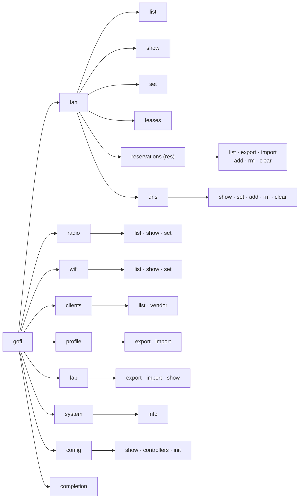
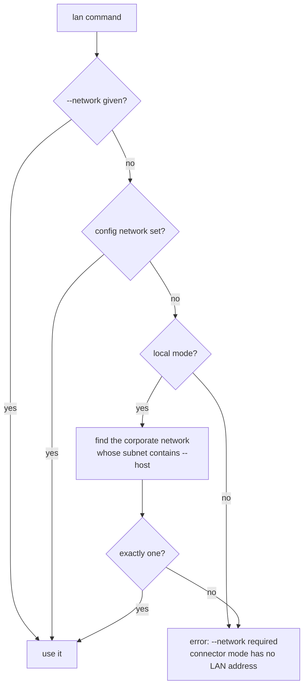
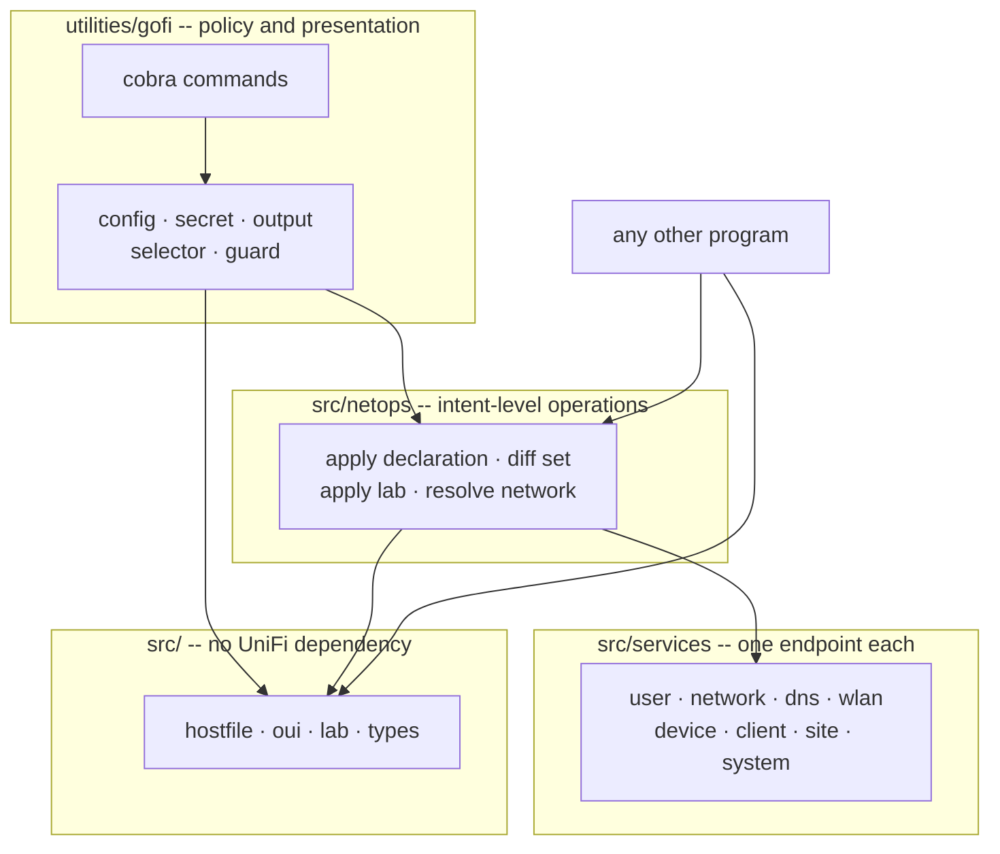

# DESIGN-CLI: the `gofi` command-line program

**Status:** design, not yet implemented. Dated 2026-07-30.

A single binary, `gofi`, that manages a UniFi UDM Pro from the shell using the same command
line as [`gogl`](https://github.com/emergingrobotics/gogl), which manages GL.iNet 4.x travel
routers.

This document specifies the command tree, its flags, its behavior, and the changes to `src/`
that it needs. It does not specify function signatures; see [`DESIGN.md`](DESIGN.md) for
library architecture.

## The module is the product

**`gofi` is a Go module for building tooling against UniFi devices. The CLI is one consumer of
it.** Not the product, not a wrapper with the real logic inside it — a consumer, and deliberately
the most demanding one available, so that building it proves the module is good enough to build
complex tooling on.

That ordering is a constraint on this design, not a sentiment:

**Nothing the CLI knows may be knowledge a second consumer would need.** If someone writing their
own program against the module would have to rediscover it — that the controller rejects a static
DNS record overlapping device-local DNS, that a device round-trip drops unmodeled JSON, how a
host declaration maps onto a user record plus a DNS record, how an IEEE OUI file parses — then it
belongs in `src/` as an exported package, and the CLI calls it like anyone else would.

**What stays in the CLI is policy and presentation only.** Flag parsing, terminal output, prompts,
confirmation, exit codes, and the three guards. A library must not prompt, must not print, must
not call `os.Exit`, and must not refuse a well-formed request because the author of a CLI thought
it was unwise.

The current tools fail this test, which is the second reason to replace them. The ISC host
declaration parser lives in `utilities/gofips/parse.go` and the IEEE OUI cache in
`utilities/gofimac/oui.go` — both `package main`, both unreachable by any other program, both
generic enough to have no UniFi dependency at all. Anyone wanting either has to copy it. Moving
them into the module is most of the [library work](#library-work) this design requires, and it is
worth doing on its own merits even if the CLI were never built.

See [Package layout](#package-layout) for where the line falls, package by package.

---

## Contents

- [The module is the product](#the-module-is-the-product)
- [Why one binary, and why this command line](#why-one-binary-and-why-this-command-line)
- [Scope and non-goals](#scope-and-non-goals)
- [Shape of the command line](#shape-of-the-command-line)
- [Verb vocabulary](#verb-vocabulary)
- [Global flags](#global-flags)
- [Configuration file](#configuration-file)
- [Passwords and secrets](#passwords-and-secrets)
- [Exit codes](#exit-codes)
- [Selectors: one router versus a controller](#selectors-one-router-versus-a-controller)
- [`gofi lan`](#gofi-lan)
- [`gofi lan reservations`](#gofi-lan-reservations)
- [`gofi lan dns`](#gofi-lan-dns)
- [`gofi radio`](#gofi-radio)
- [`gofi wifi`](#gofi-wifi)
- [`gofi clients`](#gofi-clients)
- [`gofi profile`](#gofi-profile)
- [`gofi lab`](#gofi-lab) — the portable lab definition
- [`gofi system`](#gofi-system)
- [`gofi config`](#gofi-config)
- [`gofi completion`](#gofi-completion)
- [The three guards](#the-three-guards)
- [Two things UniFi does that will surprise you](#two-things-unifi-does-that-will-surprise-you)
- [Library work](#library-work)
- [Package layout](#package-layout)
- [Testing requirements](#testing-requirements)
- [Migration from gofips, gofimac, and gofinet](#migration-from-gofips-gofimac-and-gofinet)
- [Needs hardware verification](#needs-hardware-verification)
- [Related documents](#related-documents)

---

## Why one binary, and why this command line

Three single-purpose tools exist today: `gofips` (fixed IPs and DNS), `gofimac` (clients with
OUI lookup), `gofinet` (networks and DHCP pools). Each parses its own flags with stdlib
`flag`, each resolves credentials from the environment on its own, and each solves one
quarter of the same problem. Adding a fifth mode to `gofips` or a fourth tool is the wrong
direction.

The command line is borrowed from `gogl` rather than invented, because the two tools host the
same thing on different hardware.

**The portable lab is one network definition with two possible hosts.** A set of lab devices —
boards, players, single-board computers — lives on a subnet with fixed addresses, resolvable
names, and an SSID. At home a UDM Pro serves that network. On the road a GL.iNet travel router
serves it instead. **The two are never in use at the same time.** They are the same network,
relocated, and the devices on it must not be able to tell which one they are talking to: same
subnet, same addresses, same names, same SSID, same passphrase.

That framing decides what the tools share and what they do not, and it is easy to get wrong.
Anything a device would notice must be identical on both — so it travels. Anything a device
would not notice, and anything that is a property of the *building* rather than the network,
must not travel: a channel that is clear at home is occupied in a hotel.

`gofi lab export` writes that definition; `gogl lab import` applies it, and the reverse. One
vocabulary across both tools means one thing to remember at the point where a mistake costs you
a working network in an unfamiliar place.

Where UniFi cannot support a `gogl` command, this document says so rather than inventing a
near-equivalent under the same name.

## Scope and non-goals

**In scope:** LAN addressing and DHCP pools, fixed-IP reservations, local DNS records and
domains, wireless identity (SSID, passphrase, encryption), per-radio tuning (channel, width,
power), connected clients with independent OUI lookup, whole-network capture and apply, the
portable lab definition shared with `gogl`, controller identity, and `gofi`'s own configuration.

**Not in scope for the CLI:** firewall rules, port forwarding, traffic rules, routing, VPN, port
profiles, PoE control, device adoption, RADIUS, guest portals, speed tests, backups, and the event
websocket.

**The library supports most of that already** (see [`DESIGN.md`](DESIGN.md)), and the CLI's not
exposing it is a scoping decision about one program, never a limit on the module. `gofi` the binary
is for making a network reproducible; `gofi` the module is for building whatever you need against a
UniFi controller. When a CLI command needs library capability that does not exist yet, the
capability goes into `src/` in general form and the command calls it — see
[Library work](#library-work).

**Not a UniFi admin panel replacement**, and not a byte-exact backup tool. For a full
controller backup, use the controller's own backup feature.

## Shape of the command line

```
gofi [global flags] <area> [subarea] <action> [flags] [arguments]
```

Nine areas. Eight act on the controller; `config` acts on your machine.



| Area | What it covers |
|---|---|
| `lan` | Networks, DHCP pools, leases, and the `reservations` and `dns` subareas |
| `radio` | Per-radio tuning on an access point: channel, width, transmit power |
| `wifi` | Per-WLAN identity: SSID, passphrase, encryption, hidden, enabled |
| `clients` | Connected stations, with IEEE OUI manufacturer lookup |
| `profile` | A whole network captured to JSON, and applied back — UniFi only |
| `lab` | The portable lab definition: the subset `gogl` can also host |
| `system` | Controller model, version, endpoint, auth mode |
| `config` | `gofi`'s own configuration file |
| `completion` | Shell completion scripts |

One addition to `gogl`'s tree: **`gofi lan list`**. A GL.iNet router has one LAN, so `gogl`
needs no such command. A UDM Pro has many networks, and you cannot use `lan show` until you
know their names. It uses the existing `list` verb and breaks nothing.

## Verb vocabulary

Held strictly, so a verb means one thing everywhere. Identical to `gogl`.

| Verb | Means |
|---|---|
| `list` | many items |
| `show` | one thing, in detail |
| `set` | write fields on a thing |
| `add` / `rm` | collection membership |
| `clear` | empty a collection |
| `import` / `export` | file in, file out |

Not used: `get` (ambiguous with `show`), `delete` (it is `rm`), `create` (it is `add`),
`update` (it is `set`).

This is why `lan dns set --domain X` is a field write while `lan dns add nas 192.168.4.13` is
a member add.

## Global flags

Accepted by every command.

| Flag | Default | Meaning |
|---|---|---|
| `--controller NAME` | the config file's `default` | Which configured controller to use |
| `-H`, `--host ADDR` | from config, then `UNIFI_CONTROLLER_IP` | Controller address |
| `-p`, `--port N` | `443` | Controller port |
| `-S`, `--site NAME` | `default` | UniFi site |
| `--network NAME` | resolved; see [Selectors](#selectors-one-router-versus-a-controller) | Which network `lan` acts on |
| `--insecure` | **on** | Skip certificate verification |
| `--secure` | off | Require certificate verification |
| `--https` | on | Accepted for `gogl` compatibility; `--https=false` is an error |
| `--output text\|json` | `text`, or the config's `output` | Output format |
| `-v`, `--version` | | Print version, revision, and whether the tree was dirty |
| `-h`, `--help` | | Help for any command or subcommand |

Four deliberate differences from `gogl`:

**`--controller`, not `--router`.** `gofi` can reach a controller through Ubiquiti's Site
Manager connector, where there is no router at the other end of the socket — just
`api.ui.com` forwarding to a console. `--router` and `[routers.NAME]` are accepted as
aliases so muscle memory and existing scripts keep working.

**Port 443, not 80.** GL.iNet 4.x firmware serves plain HTTP; UniFi is HTTPS-only. Same flag,
different default. `--https` exists only so a copied `gogl` command line does not fail on an
unknown flag; passing `--https=false` errors with an explanation rather than being ignored.

**`--insecure` defaults on**, matching `gogl`, because a UDM ships a self-signed certificate
and a CLI that cannot reach one out of the box is useless. The library defaults the other way:
`gofi.Config` verifies TLS at its zero value, because a library must not be insecure by
default.

**`-S/--site` and `--network` are new.** A GL.iNet router has neither. Both are additive.

> **Breaking change from the current tools.** `gofips`, `gofimac`, and `gofinet` spell this
> `-k/--secure`, where `-k` *enables* verification. That is backwards from `curl`, where `-k`
> means insecure, and the collision is a live foot-gun. `gofi` drops the `-k` short form
> entirely. A script passing `-k` fails with "unknown flag" rather than silently getting the
> opposite of what it asked for.

## Configuration file

`${XDG_CONFIG_HOME:-~/.config}/gofi/config.toml`. Override the whole path with `GOFI_CONFIG`.

A missing file is not an error — `gofi` works from flags and the environment alone, which is
how the current tools work and how they will keep working.

```toml
default = "home"
output  = "text"          # or "json"

[controllers.home]
host             = "192.168.4.1"
site             = "default"
network          = "Default"
password_command = "pass show unifi/home"

[controllers.cloud]
api_key_command = "pass show unifi/cloud-api-key"
console_id      = "70A741XXXXXXXXXXXXXXXXXXXXXXXXXX"
site            = "default"
network         = "Default"
```

| Key | Scope | Meaning |
|---|---|---|
| `default` | top level | Controller used when `--controller` is absent. Optional with one defined |
| `output` | top level | `text` or `json` |
| `host` | per controller | Address. Required in local mode, unused in connector mode |
| `port` | per controller | Defaults to 443 |
| `username` | per controller | Local admin account |
| `site` | per controller | Defaults to `default` |
| `network` | per controller | Which network `lan` acts on when `--network` is absent |
| `insecure` | per controller | TLS behaviour |
| `password_command` | per controller | A command printing the password on its first line |
| `api_key_command` | per controller | A command printing a cloud API key on its first line |
| `console_id` | per controller | Site Manager console ID; selects connector mode |

`gofi config init` writes a commented starting point.

Precedence, highest first: **command-line flag → config file → environment variable.** A flag
counts as given only if you actually typed it, so `--port 443` is distinguishable from
omitting `--port`.

Setting `console_id` (or `api_key_command`) selects connector mode, where requests go to
`https://api.ui.com` and `host`/`port` are unused. Setting both a console ID and a password is
an error rather than a silent preference — the current tools resolve that collision by
printing a note and ignoring the password, which is the wrong default for a tool that writes.

Related paths:

| What | Where |
|---|---|
| Config | `${XDG_CONFIG_HOME:-~/.config}/gofi/config.toml` |
| OUI cache | `${XDG_DATA_HOME:-~/.local/share}/gofi/oui.txt` |
| Install | `make install` |

The OUI cache moves from `gofimac/` to `gofi/`. A first run re-downloads roughly 5 MB.

## Passwords and secrets

**There is no `--password` flag, no `--api-key` flag, and there never will be.** A secret on
the command line is visible to every user through `ps` and is recorded in your shell history.

Credential resolution, highest first:

1. `UNIFI_PASSWORD` / `UNIFI_API_KEY` in the environment
2. `password_command` / `api_key_command` in the config file
3. An interactive prompt, echo off, read from `/dev/tty`

```bash
read -rsp 'controller password: ' UNIFI_PASSWORD; export UNIFI_PASSWORD   # for a session
```

Step 3 is new. The current tools fail with "UNIFI_PASSWORD environment variable is required",
which is fine for a script and hostile at a terminal.

**WiFi passphrases follow the same rule.** `gofi wifi set --passphrase` takes no value; it
prompts. For scripts, `--passphrase-command` reads it from a command's output. Passing a value
is rejected rather than silently ignored, so nothing lands in your history by accident.

The controller returns WLAN passphrases in `x_passphrase` **in cleartext** to any caller with
admin rights — the same bar as opening the admin panel. `gofi` masks them unless you pass
`--show-key`. That keeps a key out of your scrollback; it is not an access control.

## Exit codes

| Code | Meaning |
|---|---|
| `0` | Success |
| `1` | Failure: the controller was unreachable, a write was rejected, something broke |
| `2` | Usage: the command was invoked wrongly |
| `3` | **Refused by a guard:** the request was well-formed but the state was wrong |

Code 3 exists so a script can tell "I was blocked" from "it broke". It covers
`ErrDomainNotSet`, `ErrReservationsExist`, and `ErrWirelessSession` — the three
[guards](#the-three-guards).

These are CLI policy, not library errors, so the sentinels live in the CLI's `guard` package
and not in `src/errors.go`. A Go program importing the module gets no opinion about whether it
may move a subnet.

## Selectors: one router versus a controller

This is the one place the two tools genuinely differ, and it is worth stating plainly before
the command reference.

`gogl` targets a device with one LAN, one radio per band, and one SSID per band, so the LAN is
implicit and `--band` uniquely identifies both a radio and an SSID. A UDM Pro has many
networks, many access points each with several radios, and WLANs that broadcast on more than
one band at once. Three selectors resolve the difference.



**`--network NAME` selects the network** that every `lan` command acts on. Resolved as above:
an explicit flag, then the config file, then the network whose subnet contains the address you
reached the controller at. That last step is deterministic and matches intent — it is the
network you are standing on. In connector mode there is no such address, so `--network`
becomes required. `gogl`'s `lan set --guest` has no counterpart: a UniFi guest network is just
another network, selected by name.

**`--ap NAME|MAC` selects an access point** for `radio` commands, alongside `--band`. Required
only when more than one adopted AP has a radio on that band. `--device NAME` still names a
radio directly, as in `gogl`.

**`--wlan NAME` selects a WLAN** for `wifi` commands. `--band` filters `wifi list` but cannot
select for a write, because one WLAN commonly broadcasts on 2.4 and 5 GHz together. Where
`--band` matches exactly one WLAN, it works as a selector; where it matches several, `--wlan`
is required.

In every ambiguous case the rule is the same one `gogl` applies to a two-radio device that
reports one band twice: **refuse and name the choices, rather than guess.**

---

## `gofi lan`

The wired networks.

### `gofi lan list`

Every network with its subnet and DHCP pool. Replaces `gofinet`.

```console
$ gofi lan list
NETWORK     VLAN  SUBNET           DHCP-POOL                        LEASE   DNS
Default     -     192.168.4.1/24   192.168.4.100 - 192.168.4.189    86400s  1.1.1.1,8.8.8.8
cj-iot      2     192.168.10.1/24  192.168.10.100 - 192.168.10.200  86400s  -
Internet 1  -     -                (disabled)                       -       -
```

Networks with no active DHCP server — WAN, `vlan-only`, DHCP off — show `(disabled)` in the
pool column. Sorted by name. Columns are space-aligned with `text/tabwriter`.

### `gofi lan show`

One network in detail, plus the reservation arithmetic and every radio.

| Flag | Meaning |
|---|---|
| `--show-key` | Print WiFi passphrases instead of masking them |

```console
$ gofi lan show
CONTROLLER  UDM-Pro
VERSION     9.0.114
NETWORK     Default
SUBNET      192.168.4.1/24
DHCP        enabled
POOL        192.168.4.100 - 192.168.4.189  (90 addresses)
LEASE       86400s
DOMAIN      lab.example
GATEWAY     -
DNS         1.1.1.1  8.8.8.8
RESERVED    27
  IN POOL   20  (honored by the controller, excluded from the pool)
AVAILABLE   134
```

Wireless is reported alongside the wired network, because "what is this network" includes what
devices associate to it. A controller that will not report wireless still gets its network
reported — the wireless read is a warning, not a failure.

`IN POOL` appears only when reservations fall inside the DHCP range. It is reported because it
arises silently and because it explains an `AVAILABLE` count that otherwise looks wrong.

### `gofi lan set`

Writes the network address or the DHCP pool.

| Flag | Meaning |
|---|---|
| `--pool-start ADDR` | New pool start |
| `--pool-end ADDR` | New pool end |
| `--ip ADDR` | New network address |
| `--mask MASK` | New netmask |
| `--force` | Allow a subnet move while reservations exist |
| `--dry-run` | Show the change and any refusal without writing |

`--ip` and `--mask` are joined into the `ip_subnet` CIDR the controller stores. The flags stay
split because that is how `gogl` spells it and how people think about it.

**Changing only the pool** needs neither `--ip` nor `--mask`; they are read from the
controller. Nothing moves and it is never refused:

```bash
gofi lan set --pool-start 192.168.4.50 --pool-end 192.168.4.150
```

**Moving the subnet** requires all four flags together, because a pool from the old subnet
cannot be valid in a new one:

```bash
gofi lan set --ip 192.168.5.1 --mask 255.255.255.0 \
             --pool-start 192.168.5.100 --pool-end 192.168.5.149
```

In local mode that **drops your session** — the UDM changes address mid-call. `gofi` treats a
lost connection as success and tells you where to reconnect. In connector mode the session
survives, because it runs through `api.ui.com` and never depended on the LAN address.

Refused while reservations exist unless `--force`; see [the guards](#the-three-guards). A
netmask change counts as moving the subnet even when the address stays put.

### `gofi lan leases`

Lists dynamically-assigned addresses. Leases are not reservations — a lease expires. This is
how you find what is worth reserving.

```console
$ gofi lan leases
IP             MAC                HOSTNAME
192.168.4.135  6e:1d:47:db:54:54  iPhone
```

> **Degraded relative to `gogl`, permanently.** The controller exposes no DHCP lease table.
> This list is derived from active clients on the selected network that hold no fixed IP,
> which answers the question the command exists for. **There is no `EXPIRES` column**, because
> no verified endpoint reports lease expiry. A client that is offline but still holds a lease
> does not appear.

---

## `gofi lan reservations`

Static MAC-to-IP bindings. Aliased as `res`, since the canonical form is four words. Replaces
`gofips`.

**Each host declaration is one or two writes.** A fixed-IP binding on the user record always,
and a static DNS record for the qualified name unless the controller's own device-local DNS
already answers it correctly. The controller auto-registers the bare name and rejects static
records that overlap it, so the second write is conditional rather than unconditional — see
[Two things UniFi does](#two-things-unifi-does-that-will-surprise-you). These commands keep
both in step, so you write one declaration and get working resolution.

The text format is ISC DHCP host declarations, kept on its own merits: it diffs, it reviews, it
lives in git, and it is what a `gogl` router reads.

### `gofi lan reservations list`

Lists the reservations. Text output is ISC DHCP format; `--output json` gives the raw records.

### `gofi lan reservations export`

Writes every reservation on the selected network to stdout.

```console
$ gofi lan reservations export > lab.hosts
$ head -8 lab.hosts
# gofi reservations
# exported from UniFi controller at 192.168.4.1
# network: Default  subnet: 192.168.4.1/24  pool: 192.168.4.100-192.168.4.189
# date: 2026-07-30

host europa {
    hardware ethernet 10:51:07:1f:8d:1c;
    fixed-address 192.168.4.10;
}
```

Sorted by IP numerically. Where a DNS record exists with a different hostname than the user
record, a comment warning is emitted above that entry.

### `gofi lan reservations import [file]`

Imports host declarations from a file, or stdin when no file is given.

| Flag | Meaning |
|---|---|
| `--prune` | Also delete reservations and DNS records on the controller but absent from the file |
| `--force` | Proceed past conflicts |
| `--dry-run` | Show what would change without changing it |

Four phases, in a deliberate order. All file validation before any controller contact, so a
malformed file never half-writes a controller. All reads before any write, so the diff is
against one snapshot. Then bindings one at a time, then DNS records.

Validation, all of it before connecting: hostnames DNS-safe (`[a-zA-Z0-9._-]+`, 63 per label,
253 total), MACs valid colon-separated hex, IPv4 only, and no duplicate hostname, MAC, or IP
within the file. Every error is reported with its line number, and none of them connect.

**Idempotent.** A second run reports everything skipped. That is what makes a host file usable
as a checked-in description of a network.

**Repairs drift.** Bindings and DNS records are diffed separately, so a binding whose DNS
record went missing gets the record back rather than being skipped because the binding
matched.

Each IP is matched to the network whose subnet contains it, and the binding is written with
that network's ID. An IP in no network's subnet is an error for that entry; the run continues
and exits 1 at the end.

Requires a configured domain — see [the guards](#the-three-guards).

`--prune` is new; `gofips --set` has no counterpart. Without it, import only adds and updates,
which means a host file cannot express deletion. With it, the file is the whole truth.

### `gofi lan reservations add [declaration]`

Adds one host, by flags or as a declaration fragment.

| Flag | Meaning |
|---|---|
| `--name NAME` | Hostname |
| `--mac MAC` | MAC address |
| `--ip ADDR` | IPv4 address |
| `--force` | Proceed past conflicts |
| `--dry-run` | Show what would change without changing it |

```bash
gofi lan reservations add --name nas --mac aa:bb:cc:dd:ee:01 --ip 192.168.4.13
gofi lan reservations add 'host nas { hardware ethernet aa:bb:cc:dd:ee:01; fixed-address 192.168.4.13; }'
```

The three flags are required together. Giving both a declaration and flags is an error rather
than a silent preference. With neither, the fragment is read from stdin.

Conflicts checked unless `--force`: the IP assigned to a different MAC, the MAC assigned a
different IP, or a DNS record with this hostname pointing somewhere else.

### `gofi lan reservations rm`

Removes one host and its DNS record, identified by exactly one of `--name`, `--mac`, `--ip`.

| Flag | Meaning |
|---|---|
| `--name`, `--mac`, `--ip` | Which host |
| `--force` | Skip the confirmation prompt; also delete the user record itself |
| `--keep-dns` | Leave the DNS record in place |
| `--dry-run` | Show what would change without changing it |

The DNS record goes first, then the binding. A leftover binding is an address with no name,
which the next import repairs; a leftover name keeps resolving to an address nothing holds,
which is the worse failure.

By default the fixed IP is cleared and the user record is kept, because the user record also
carries the name, note, and group. `--force` deletes it outright.

Multiple matches are listed and exit 3 unless `--force`. Confirmation is skipped when stdout
is not a terminal.

### `gofi lan reservations clear`

Removes **every** reservation and **every** paired DNS record on the selected network.

| Flag | Meaning |
|---|---|
| `--force` | Skip the confirmation prompt |
| `--dry-run` | List what would go without removing it |

Both, because they are one intent stored in two places. The network's domain survives — it is
configuration, not content.

This is also the precondition for moving the subnet without `--force`.

---

## `gofi lan dns`

The DNS domain and the records the controller resolves.

**A reservation creates a bare-name record, but not a qualified one.** A fixed IP with a name
is auto-registered in the UDM's device-local DNS, so `nas` resolves with no further work.
`nas.lab.example` does not — and a client running `systemd-resolved` qualifies a single-label
name before it ever asks, so on a network with a domain the bare record alone leaves `ping nas`
failing. These commands write the static records that make the qualified form resolve, and the
domain that makes qualification meaningful.

Static records cannot override device-local DNS. The controller rejects an overlapping create
with `api.err.StaticDnsOverlapsWithDeviceLocalDns`, which `gofi` treats as success when the
device-local answer is already correct and as drift when it is not. See
[Two things UniFi does](#two-things-unifi-does-that-will-surprise-you).

### `gofi lan dns show`

Reports the selected network's domain and every record.

```console
$ gofi lan dns show
DOMAIN     lab.example

ADDRESS         NAME             TYPE  SOURCE        MANAGED
192.168.4.13    nas              -     device-local  yes
192.168.4.13    nas.lab.example  A     static        yes
192.168.4.14    pi.lab.example   A     static        yes
192.168.4.200   vault            A     static        no
```

With no domain configured it says so, because that state blocks every reservation write.

`SOURCE` distinguishes the two mechanisms. `static` rows come from the API. `device-local` rows
have no endpoint that lists them — they are discovered by querying the controller's own resolver
on port 53 for each reservation's name, the technique `gofips` already uses. A controller that
does not answer DNS queries gets its device-local rows omitted with a warning rather than
failing the command.

`MANAGED` marks records that pair with a reservation on this network. It exists because of the
scoping problem `clear` has to solve, below.

### `gofi lan dns set`

Sets the network's DNS domain.

| Flag | Meaning |
|---|---|
| `--domain DOMAIN` | The DNS suffix, e.g. `lab.example` |

Required before any reservation write. Changing an existing domain requalifies every managed
record, so resolution does not split between two suffixes.

This writes the network's `domain_name`, which the controller hands out over DHCP as the search
domain — a real setting, unlike GL.iNet, where `gogl` has to keep the suffix inside its own
host-file block because the firmware exposes none. Records are still written fully qualified,
so they resolve regardless of a client's search list.

### `gofi lan dns add NAME ADDR`

Points a name at an address, as an A record. A bare name is qualified with the network's
domain. A name already in use is replaced.

Where device-local DNS already answers the name with the address you asked for, no static
record is written and the command reports why — the controller would reject it as overlapping
anyway. Where device-local DNS answers with a *different* address, that is reported as an error
naming both values, because a static record cannot override it and the fix is to correct the
reservation instead.

### `gofi lan dns rm NAME`

Removes a record, in either its bare or qualified form.

### `gofi lan dns clear`

Removes every **managed** record — those that pair with a reservation on the selected network.

| Flag | Meaning |
|---|---|
| `--all` | Also remove records that pair with no reservation |
| `--force` | Skip the confirmation prompt |
| `--dry-run` | List what would go without removing it |

> **Decision, 2026-07-30.** `gogl` bounds this by its own delimited block in the router's host
> file, and cannot touch anything it did not write. UniFi static DNS records carry no such
> marker and no field to put one in. Deleting every static DNS record by default would destroy
> hand-made entries — a CNAME for an internal service, a TXT record for domain validation —
> that `gofi` never created and cannot recreate. So the default scope is "records this tool
> would have written", computed by pairing each record against a reservation, and `--all` is
> the explicit way to go further. Non-A records are never removed without `--all`.

This leaves reservations in place. To clear both, use `gofi lan reservations clear`.

---

## `gofi radio`

Per-radio tuning on an access point: the fields the controller scopes by radio rather than by
SSID, so they affect every WLAN on that radio.

### Selecting a radio

`--band 2.4`, `--band 5`, or `--band 6`. Spellings like `2`, `2g`, `2.4GHz` all work.

Resolution reads the band each radio **reports** — never a static `ra0`/`rai0` map. `--ap
NAME|MAC` picks the access point, and is required when more than one adopted AP has a radio on
the requested band. `--device NAME` names a radio on that AP directly and overrides `--band`.

A UDM Pro with no adopted APs has no radios, and every `radio` command says so and exits 1.

### `gofi radio list`

Every radio on every AP.

```console
$ gofi radio list
AP          BAND  RADIO  CHANNEL  WIDTH  POWER   STATE    CLIENTS
U6-Pro-off  2.4G  ng     6        20     medium  RUNNING  4
U6-Pro-off  5G    na     44       80     high    RUNNING  11
U6-LR-shop  5G    na     149      80     auto    RUNNING  3
```

> **Degraded relative to `gogl`, permanently.** `gogl radio list` prints the channels,
> bandwidths, hardware modes, and power levels each radio accepts, and validates against them
> before writing. The controller exposes no such capability list in any verified endpoint. It
> validates server-side and rejects. `gofi` therefore cannot validate a channel locally, and
> relays the controller's rejection instead of naming the valid choices. Widths and power
> levels are validated against the fixed sets UniFi accepts (`20/40/80/160`,
> `low/medium/high/auto`); channels are not.

### `gofi radio show`

One radio in detail. Takes `--band`/`--device` plus `--ap`.

### `gofi radio set`

| Flag | Meaning |
|---|---|
| `--ap`, `--band`, `--device` | Which radio |
| `--channel N` | Channel, or `0` for automatic |
| `--width MHZ` | `20`, `40`, `80`, `160` |
| `--power LEVEL` | `low`, `medium`, `high`, `auto`, or a dBm value |
| `--yes` | Skip the confirmation prompt |
| `--dry-run` | Show the change and any refusal without writing |

```bash
gofi radio set --ap U6-Pro-off --band 5 --channel 149
gofi radio set --ap U6-Pro-off --band 2.4 --channel 0        # automatic
gofi radio set --ap U6-Pro-off --device na --width 80 --power low
```

`--hwmode` from `gogl` has no counterpart. UniFi derives the 802.11 mode from the hardware and
the width; there is no field to write.

**Only the fields you name are sent.** This is the constraint driving the library change in
[Library work](#library-work): a whole-struct `PUT` of a `Device` would
silently drop every `radio_table` field the Go type does not model, which on an AP includes
minimum RSSI, antenna gain, and vendor extensions. Radio writes must merge into the device's
existing `radio_table`, not replace it.

Refused over a wireless session — see [the guards](#the-three-guards).

**DFS channels get a warning.** The radio must vacate one if it detects radar, taking every
client with it for the minutes it spends re-scanning. A poor choice for kit that has to come up
reliably in an unfamiliar building.

---

## `gofi wifi`

Per-WLAN identity: the fields the controller scopes by SSID rather than by radio.

Selected by `--wlan NAME`. `--band` filters `wifi list`, and selects for a write only when it
matches exactly one WLAN; otherwise `--wlan` is required. `--guest` filters to WLANs marked
`is_guest`.

### `gofi wifi list`

Every WLAN. `--show-key` reveals passphrases.

```console
$ gofi wifi list
WLAN       BANDS    SECURITY   HIDDEN  STATE    NETWORK  KEY
lab        2g,5g    wpapsk     no      enabled  Default  (14 characters, --show-key to reveal)
lab-guest  2g,5g    wpapsk     no      enabled  guest    (12 characters, --show-key to reveal)
lab-iot    2g       wpapsk     yes     enabled  cj-iot   (16 characters, --show-key to reveal)
```

### `gofi wifi show`

One WLAN, with its passphrase length rather than its value.

### `gofi wifi set`

| Flag | Meaning |
|---|---|
| `--wlan`, `--band`, `--guest` | Which WLAN |
| `--ssid NAME` | New SSID, up to 32 characters |
| `--passphrase` | **Takes no value.** Prompts, echo off |
| `--passphrase-command CMD` | Read the passphrase from a command's first line |
| `--encryption MODE` | `open`, `wpapsk`, `wpa3`, `wpa3-transition` |
| `--bands LIST` | e.g. `2g,5g` |
| `--hidden=true\|false` | Whether the SSID is advertised |
| `--enabled=true\|false` | Whether the WLAN is up |
| `--yes` | Skip the confirmation prompt |
| `--dry-run` | Show the change and any refusal without writing |

```bash
gofi wifi set --wlan lab --ssid site-main
gofi wifi set --wlan lab --passphrase
gofi wifi set --wlan lab-guest --enabled=true --hidden=false
```

**Note `--hidden=false`, with the value attached.** A partial update must distinguish "set this
to false" from "leave it alone", and a bare boolean flag meaning true is how `--enabled` ends
up disabling something.

**Only the fields you name are sent.** The WLAN is read, the named fields are changed, and the
result is written back — which is safe here in a way it is not for a device, because
`types.WLAN` models the WLAN object comprehensively.

`--ssid` renames the WLAN in place rather than creating a second one. `gogl wifi set --band 5
--ssid lab-5g` gives a band its own name; the UniFi equivalent is a WLAN restricted to that
band, which is `--bands 5g` on a separate WLAN.

`gofi wifi` does not create or delete WLANs — that is a network topology change, not an identity
change, and `add`/`rm` are deliberately absent from this area. Creating one is the job of
`gofi lab import --create` or `gofi profile import`, where it happens as part of building a
network rather than as a standalone act.

Refused over a wireless session; `--yes` does not override that.

---

## `gofi clients`

Connected stations. Its own area rather than part of `lan`, because a station arrives over
cable, 2.4 GHz or 5 GHz and the useful view is all of them together. Replaces `gofimac`.

### `gofi clients list`

| Flag | Meaning |
|---|---|
| `-a`, `--all` | Include clients the controller remembers but does not currently see |
| `-w`, `--wifi` | Only wireless stations |
| `-e`, `--wired` | Only wired stations |
| `-r`, `--reserved` | Mark which stations hold a reservation |

```console
$ gofi clients list
MAC                ADDRESS        HOSTNAME  MANUFACTURER      SINCE
10:51:07:1f:8d:1c  192.168.4.10   europa    Intel Corporate   3h12m0s
6e:1d:47:db:54:54  192.168.4.135  iPhone    randomized        41m0s
```

Only clients the controller currently sees, by default, from active clients. `--all` adds
known clients and an `ONLINE` column. Sorted by IP numerically; clients with no address sort
last and show `-`.

Hostname is `Name` if set, else `Hostname`, else `unknown`. `SINCE` comes from the client's
uptime. `--output json` emits the full record, with WiFi fields (`essid`, `ap_mac`, `channel`,
`radio`, `signal`) or wired fields (`sw_mac`, `sw_port`) as appropriate, and zero values
omitted.

**The manufacturer never comes from the controller's `oui` field**, which is frequently stale.
It comes from the IEEE registry at `https://standards-oui.ieee.org/oui/oui.txt`, cached at
`${XDG_DATA_HOME:-~/.local/share}/gofi/oui.txt` and re-downloaded when older than 30 days.
A failed download falls back to a stale cache with a warning on stderr; a failed download with
no cache exits 1 rather than printing a table of blanks. `randomized` means a
locally-administered address that identifies nobody by design.

### `gofi clients vendor MAC`

Looks up a MAC's manufacturer. **Entirely offline** — reads the cache and never opens a
session.

```console
$ gofi clients vendor b4:0e:cf:2a:85:6f
b4:0e:cf:2a:85:6f  Bouffalo Lab (Nanjing) Co., Ltd.
```

---

## `gofi profile`

A whole network captured to JSON, and applied back.

**A profile is not a controller backup.** It carries what defines a *network*: the selected
networks and their pools, reservations, DNS records and domains, WLAN identity, and radio
tuning per AP. It omits everything identifying a particular installation — device serials,
adoption state, uptime, WAN credentials, controller admins. That omission is the point: those
fields are what make a full config dump useless anywhere else. Client MACs *are* included,
since a reservation is a MAC-to-IP binding.

Absent for a reason: firewall rules, port forwarding, traffic rules, routing, VPN, port
profiles. All are in scope for the library and out of scope for `gofi`.

For a byte-exact backup of one controller, use the controller's own backup.

### `gofi profile export`

| Flag | Meaning |
|---|---|
| `--with-keys` | Include WiFi passphrases in cleartext |
| `--all-networks` | Every network, not just the selected one |

```bash
gofi profile export > lab.json                 # no passphrases; safe to commit
gofi profile export --with-keys > lab.json     # passphrases included
```

**An omitted key is not an empty key.** On import a missing key is not written at all, leaving
whatever the target already has — so the private default is also the safe one.

### `gofi profile import [file]`

| Flag | Meaning |
|---|---|
| `--wireless` | Apply the WLAN and radio sections too; needs a wired session |
| `--force` | Allow a subnet move while reservations exist |
| `--dry-run` | Show what would change without changing it |

Applied in a fixed order, each step where it is because doing it later fails.

```mermaid
sequenceDiagram
    participant gofi
    participant Controller
    gofi->>Controller: 1. domain (network domain_name)
    Note over gofi: reservation writes are refused without one
    gofi->>Controller: 2. network address and pool
    Note over gofi: reservations must be inside the subnet first
    gofi->>Controller: 3. reservations (fixed IP per user)
    gofi->>Controller: 4. DNS records
    gofi->>Controller: 5. WLANs, then radios (opt-in, last)
    Note over gofi: most likely to be refused;<br/>a refusal must not undo the addressing
```

**If the profile's subnet differs from the target's, a local-mode run stops after step 2** and
prints how to resume: the controller changes address mid-write and nothing after that is
reachable from the same session. Reporting success for a partly-applied profile would be a lie.
**In connector mode the run continues**, because the session goes through `api.ui.com` and does
not depend on the LAN address. This is a real advantage of connector mode for cloning work and
the reason `gofi` keeps both auth paths.

A **model mismatch warns rather than fails.** Addresses, names, and wireless *identity* are
portable. Radio *tuning* is not — AP models, radio names, channel lists and regulatory domains
differ, and a channel that is clear in one building is occupied in another. WLANs and radios the
target lacks are reported and skipped.

Idempotent: a second run reports nothing to do.

Unknown fields in a profile are an **error**. A file from a newer `gofi` may carry a section
this build would silently drop, and silently dropping part of a network is worse than refusing
the file.

**A `gofi` profile is not a `gogl` profile.** The schemas describe different hardware and are
not interchangeable, and neither tool will read the other's. The interchange format between
UniFi and GL.iNet is the ISC host file:

```bash
gofi -H 192.168.4.1 lan reservations export > home.hosts
gogl lan dns set --domain lab.example
gogl lan reservations import home.hosts
```

---

## `gofi lab`

The portable lab definition: everything needed to stand this network up on either a UDM Pro or
a GL.iNet travel router, and nothing else. `gogl` implements the same area over the same files.

A lab is **two files sharing a stem**:

| File | Format | Carries | Changes |
|---|---|---|---|
| `NAME.hosts` | ISC DHCP host declarations | one block per device: hostname, MAC, address | often |
| `NAME.lab` | TOML | the envelope: subnet, pool, domain, wireless identity | rarely |

Two files rather than one because they change at completely different rates. You add a board to
`.hosts` most weeks; you change the subnet or the SSID almost never. Splitting them keeps the
noisy file small and diffable, keeps the stable file readable at a glance, and leaves `.hosts`
consumable by real `dhcpd` and by every existing `gofips`/`gogl` workflow.

Neither file carries anything a device cannot notice.

### The `.lab` file

```toml
# lab definition, format 1 -- portable between UniFi and GL.iNet
# written by gofi lab export home
#
# Radio tuning (channel, width, power) is deliberately absent: it is a property
# of the building, not of the network. Each host picks its own.

version = 1
name    = "home"

[network]
address    = "192.168.8.1/24"     # the router's own address and prefix
pool_start = "192.168.8.100"
pool_end   = "192.168.8.149"
domain     = "lab.example"
lease      = "12h"                # advisory; see the table below

[[wlan]]
ssid       = "labnet"
encryption = "wpa2"
bands      = ["2.4", "5"]
hidden     = false
enabled    = true
guest      = false
# passphrase omitted by default; see Passphrases below

[hosts]
file = "home.hosts"
```

`version` is required. An unrecognised version is an error, not a warning: a file from a newer
tool may carry a field this build would silently drop, and silently dropping part of a network
is worse than refusing the file. Unknown keys are an error for the same reason.

### `[network]`

| Key | Required | UniFi | GL.iNet |
|---|---|---|---|
| `address` | yes | `ip_subnet` verbatim | `lan set --ip` + `--mask` |
| `pool_start` | yes | `dhcpd_start` | `lan set --pool-start` |
| `pool_end` | yes | `dhcpd_stop` | `lan set --pool-end` |
| `domain` | yes | `domain_name` on the network | `lan dns set --domain` |
| `lease` | no | `dhcpd_leasetime` | **advisory — cannot be written** |

`address` is the router's own address with a prefix length, which is `ip_subnet` exactly as
UniFi stores it, and trivially splits into `gogl`'s `--ip` and `--mask`. One field rather than a
separate subnet, netmask and gateway, so there is nothing for a hand edit to make
self-contradictory.

`lease` is written by `gofi` and **ignored with a note by `gogl`**, which has no endpoint for it.
It is in the file because the recommended way to handle every field `gogl` cannot write is to
set the UniFi side to GL.iNet's default, and a value in the file is how you check that you did:

| Field | GL.iNet default | Set on UniFi | In the file |
|---|---|---|---|
| Lease time | 12h | `dhcpd_leasetime: 43200` | `lease = "12h"` |
| DHCP-advertised DNS | the router itself | `dhcpd_dns_enabled: false` | absent |
| Advertised gateway | the router itself | `dhcpd_gateway_enabled: false` | absent |

The last two are absent because there is no value to carry — "the router advertises itself" is
the only state both can express, so both tools assert it and neither transmits it. `gofi lab
import` sets those two fields to `false` unconditionally, and `gofi lab show` reports it when
they are not.

### `[[wlan]]`

An array, so a lab can carry a main SSID and one restricted to 2.4 GHz for boards whose radios
are 2.4-only — the common case for RP2040-class hardware.

| Key | Required | Neutral values |
|---|---|---|
| `ssid` | yes | up to 32 characters |
| `encryption` | yes | `open`, `wpa2`, `wpa2-wpa3`, `wpa3` |
| `bands` | yes | any of `2.4`, `5`, `6` |
| `hidden` | no, default `false` | |
| `enabled` | no, default `true` | |
| `guest` | no, default `false` | |
| `passphrase` | no | see below |

`encryption` uses a neutral vocabulary because neither device's spelling is portable:

| `.lab` | UniFi | GL.iNet |
|---|---|---|
| `open` | `security: open` | `none` |
| `wpa2` | `security: wpapsk`, `wpa_mode: wpa2` | `psk2` |
| `wpa2-wpa3` | `security: wpapsk`, `wpa3_support: true`, `wpa3_transition: true` | `sae-mixed` |
| `wpa3` | `security: wpapsk`, `wpa3_support: true` | `sae` |

WPA/WPA2 mixed mode (`psk-mixed`) is deliberately unrepresentable. It exists for clients that
predate WPA2, it weakens every client on the SSID, and a lab that needs it can set it by hand on
both devices.

**Band projection is the lossy part, in one direction only.** A UniFi WLAN spans bands; a
GL.iNet interface is one band. So `bands = ["2.4", "5"]` is one WLAN on UniFi and two interfaces
on GL.iNet, which is fine — the SSID and passphrase match, so a client roams between them
without noticing. What does not fit is more than one non-guest WLAN on the same band: GL.iNet has
exactly one main and one guest interface per band. `gogl lab import` reports and skips the
excess rather than guessing which one matters; `gofi lab export` warns at export time, which is
where the problem is cheaper to see.

### Passphrases

**Omitted by default.** `gofi lab export` writes no `passphrase` key, so a `.lab` file is safe to
commit. `--with-keys` writes it in cleartext, matching `profile export`.

**An omitted passphrase is not an empty passphrase.** On import a missing key is not written at
all, leaving whatever the target already has — so the private default is also the safe one, and
a first-time import onto a factory-reset router prompts rather than setting an empty key.

A hand-added `passphrase_command` key is read the same way as the config file's, so a lab can
live in git with its key in `pass`:

```toml
[[wlan]]
ssid                = "labnet"
passphrase_command  = "pass show lab/wifi"
```

### `gofi lab export NAME`

Writes `NAME.lab` and `NAME.hosts`.

| Flag | Meaning |
|---|---|
| `--with-keys` | Include WiFi passphrases in cleartext |
| `--stdout` | Write the `.lab` file to stdout and skip the `.hosts` file |

```bash
gofi lab export home                 # home.lab + home.hosts, no passphrases
git add home.lab home.hosts
```

The reservations half is `lan reservations export` with the same output, so the two commands
never disagree about the format.

### `gofi lab import NAME`

Reads `NAME.lab`, and the `.hosts` file it names.

| Flag | Meaning |
|---|---|
| `--create` | Create the network and any WLANs that do not exist |
| `--wireless` | Apply the WLAN sections; needs a wired session |
| `--prune` | Delete reservations on the controller but absent from the `.hosts` file |
| `--force` | Allow a subnet move while reservations exist |
| `--dry-run` | Show what would change without changing it |

Applied in the same fixed order as `profile import`, and for the same reasons: domain, then
network, then reservations, then DNS, then wireless last because it is the most likely to be
refused and a refusal there must not undo the addressing.

**All validation happens before connecting.** Both files parsed, `version` checked, unknown keys
rejected, addresses checked for being IPv4, the pool checked for being inside the subnet, every
host checked for a DNS-safe name and a valid MAC, and the whole set checked for duplicate names,
MACs and addresses. A malformed pair never half-writes a controller.

Hosts outside the `.lab` subnet are an error naming both, because it means the two files have
drifted apart — the single most likely way to break a lab, and the reason the subnet lives in a
file at all rather than in a comment.

`--create` is off by default and needed only on a first run, where creating a network and a WLAN
is the deliberate act of standing the lab up somewhere new. Without it, a missing network is an
error naming the subnet it looked for.

### `gofi lab show NAME`

Diffs a lab definition against the controller without writing anything. Reports per section:
matching, differing with both values, or absent. Exits 0 when the controller matches the
definition and 1 when it does not, so it works as a check in CI or a pre-trip script:

```bash
gofi lab show home || echo "controller has drifted from home.lab"
```

This is what `--dry-run` would print, available without the intent to write.

### What a lab deliberately cannot carry

| Excluded | Why |
|---|---|
| Channel, width, transmit power | Properties of the building. A clear channel at home is occupied in a hotel |
| VLAN tag | No concept on GL.iNet |
| Firewall, routing, NAT, QoS, port forwarding | `gogl` writes none of it; a boundary one device cannot express makes the two non-equivalent |
| AP groups, band steering, min RSSI, fast roaming, schedules | Multi-AP concepts with no counterpart on a single-radio router |
| RADIUS, portals | Same |
| mDNS, IGMP snooping, DHCP guard, ARP inspection | No counterpart, and no device notices |
| DNS records | Materialised differently on each side; see below |
| Any device identity | Serials, MACs of the infrastructure, adoption state, uptime |

**DNS records are the interesting exclusion.** A lab carries hostnames and a domain, never
records. UniFi auto-registers the bare name from the reservation and needs a static record only
for the qualified form; GL.iNet's reservation names are inert and need explicit host-file entries
for both forms. A shared list of records would therefore be wrong on arrival in both directions.
The host declaration plus the domain carries the intent, and each tool materialises resolution
its own way — which is exactly what `internal/dnsmgr` and `gogl`'s host-file writer already do.

---

## `gofi system`

### `gofi system info`

```console
$ gofi system info
CONTROLLER  UDM-Pro
VERSION     9.0.114
SITE        default
AUTH        connector (console 70A741XX…)
ENDPOINT    https://api.ui.com/v1/connector/consoles/70A741XX…/proxy/network
```

`AUTH` and `ENDPOINT` are additions to `gogl system info`. With two auth mechanisms and a
connector that rewrites every path, "which way did this request actually go" is the first
question when something behaves unexpectedly.

---

## `gofi config`

`gofi`'s own configuration. The only area acting on your machine rather than a controller.

### `gofi config show`

Where the file is, whether it exists, and what it resolves to.

### `gofi config controllers`

Aliased as `routers`.

```console
$ gofi config controllers
NAME            HOST         SITE     NETWORK  AUTH         CREDENTIAL
home (default)  192.168.4.1  default  Default  local        command
cloud           -            default  Default  connector    command
travel          192.168.8.1  default  Default  local        environment or prompt
```

### `gofi config init`

Writes a commented starting file. `--force` overwrites an existing one.

---

## `gofi completion`

```bash
gofi completion bash > /etc/bash_completion.d/gofi
gofi completion zsh  > "${fpath[1]}/_gofi"
gofi completion fish > ~/.config/fish/completions/gofi.fish
```

Completion is why the CLI uses `spf13/cobra` rather than stdlib `flag`, which the current three
tools use. Cobra also gives the `<area> [subarea] <action>` tree, `--help` at every level, and
attached-value booleans (`--hidden=false`) for free. It and `spf13/pflag` are the first
dependencies added to a module that currently requires only `gorilla/websocket`, and they are
confined to the CLI — the library gains nothing and keeps its dependency set.

---

## The three guards

Each refuses a well-formed request because the state is wrong, and each exits **3**.

### A reservation write requires a configured domain

`ErrDomainNotSet`. A binding with no name is an address nothing can find, and nothing in the
controller's UI flags it as incomplete. Making the domain a precondition turns a silent
omission into an error where the mistake is.

Reads and deletes are ungated; only writes that create addressing are.

```bash
gofi lan dns set --domain lab.example      # once per network
```

### Moving a subnet requires no reservations

`ErrReservationsExist`, unless `--force`.

**The rationale differs from `gogl`'s, and this matters.** `gogl` guards this because GL.iNet
firmware *silently renumbers* reservations into the new subnet, preserving host parts — usually
what you want, entirely unannounced. UniFi stores each fixed IP as a literal address plus a
network ID on the user record, so there is no reason to expect renumbering. The likely outcome
is the opposite: reservations left pointing at addresses outside their own network, which the
controller may reject, ignore, or hand out anyway.

So the guard is the same and `--force` means something different. On GL.iNet, `--force` accepts
a rewrite. Here it accepts stranding. The refusal message says so, and points at
`gofi lan reservations export` before `clear`.

A pool-only change is never guarded, because nothing moves.

**This behavior is unverified against hardware.** See
[Needs hardware verification](#needs-hardware-verification).

### A wireless write requires a wired session

`ErrWirelessSession`. Changing an SSID, passphrase or channel drops every client on that
radio. Unlike a subnet renumber there is no new address to reconnect at: the network the
session was using stops existing under that name.

`gofi` finds the address it reached the controller from, looks it up in the controller's own
active client list, and reads `is_wired`. Anything but wired is refused. A session from off-LAN
is allowed, since no radio here carries it.

**In connector mode the guard does not apply** and is skipped with a note. The session runs
through `api.ui.com`; no local radio carries it, and dropping every client on an AP cannot
sever it. That is a genuine capability difference, not a loophole — it is the safe way to
re-key a WLAN you are standing on.

`--yes` does **not** override this in local mode. The prompt is about intent; the guard is about
whether you can still reach the device afterward, and no amount of intent makes a severed
session recoverable.

---

## Two things UniFi does that will surprise you

### A reservation half-creates a DNS record, and the half it creates cannot be overridden

The admin panel shows a client with a Name and a fixed IP, so the Name reads as a DNS name. It
is — but only in its bare form. The controller auto-registers `nas` in device-local DNS from
the reservation, governed by `local_dns_record_enabled` on the user record. It does not register
`nas.lab.example`, and a Linux client running `systemd-resolved` qualifies a single-label
lookup before sending it, so the bare record it did create is the one such clients never ask
for. That is the defect
[`utilities/docs/gofips/DESIGN-2026-07-18-fqdn-dns-and-set-force.md`](../utilities/docs/gofips/DESIGN-2026-07-18-fqdn-dns-and-set-force.md)
was written to fix.

Worse, the two mechanisms are not layered. A static record that collides with a device-local
name is **rejected**, not preferred: `api.err.StaticDnsOverlapsWithDeviceLocalDns`. So you
cannot correct a wrong device-local answer with a static record. The reservation is the only
thing that can change it.

Four separate things, not three:

| What | Mechanism | Who controls it |
|---|---|---|
| The address a device receives | `use_fixedip` + `fixed_ip` on the user record | `gofi` |
| The bare name, resolving | device-local DNS, auto-registered from the reservation | the controller |
| The qualified name, resolving | a static DNS A record keyed on the FQDN | `gofi` |
| A name a device announces | its DHCP lease hostname | the client |

`gofi` writes the first and third from one host declaration and lets the controller do the
second, so this is invisible in normal use. What it means in practice: `dns add` must consult
the controller's own resolver before writing, treat an overlap rejection as success when the
answer is already right, and report drift rather than retry when it is not. `internal/dnsmgr`
inherits this logic from `gofips`, where it is already implemented and hardware-tested.

**This is the opposite of GL.iNet**, where a reservation's name is inert and every resolving
name must be written into the host file explicitly. Both tools therefore need the same *input*
— one host declaration carrying name, MAC, and address — and produce resolution differently
from it. That asymmetry is the reason the interchange format carries declarations rather than
DNS records.

### A device round-trip drops fields the Go type does not model

`DeviceService.Update` marshals the whole `types.Device` and `PUT`s it. Any JSON field absent
from the struct is absent from the request, and the controller takes the request as the new
truth. For an access point that includes `radio_table` entries this library does not yet model.

This is a property of the library, not the controller, and it is the reason `gofi radio set`
cannot be built on `Update` as it stands. See below.

---

## Library work

Most of what the CLI needs already exists in `src/`. What it needs that does not exist is,
with one exception, generic enough to belong there regardless of whether the CLI is ever built —
which is the test from [The module is the product](#the-module-is-the-product) applied concretely.

### New exported packages

Four packages, none of which has any UniFi dependency except the last, and all of which a
third-party consumer has a plain reason to want:

| Package | Contents | Lifted from |
|---|---|---|
| `src/hostfile` | ISC DHCP host declaration parse and emit, validation, IP-order sort | `utilities/gofips/parse.go`, `format.go` |
| `src/oui` | IEEE OUI download, 30-day cache, parse, MAC lookup | `utilities/gofimac/oui.go` |
| `src/lab` | The `.lab` TOML schema, the two-file pair, encryption and band mapping | new |
| `src/netops` | Intent-level operations composed from services — see below | `utilities/gofips/operations.go` |

`src/hostfile` and `src/oui` are lifts of code that is already written and already hardware-tested.
They move as-is, gaining only exported names and package docs. Neither imports anything else in
the module.

`src/lab` is the interchange format. It belongs in the library because a format is a contract:
anyone writing a tool that produces or consumes a lab definition needs to parse it, and having
exactly one implementation of the encryption and band mapping tables is the difference between an
interchange format and two programs that nearly agree.

### `src/netops`: the operations layer

The gap the current design has, and the reason `gofips` is 500 lines of `package main` that nobody
else can call. Services are one endpoint each; real work is several endpoints plus knowledge of how
the controller misbehaves. That knowledge is the module's most valuable content and it currently
lives in a binary.

Operations worth exporting, all of them already implemented inside `gofips` or specified in this
document:

- **Apply a host declaration** — resolve the owning network by subnet, write the fixed IP on the
  user record, then reconcile DNS: consult the controller's own resolver, skip the static record
  where device-local DNS already answers correctly, replace a stale bare-name record, treat an
  overlap rejection as success, and report drift where device-local DNS answers wrongly. No
  consumer should have to derive that twice.
- **Diff and apply a set of declarations** — the four-phase ordering, idempotence, and drift
  repair that `lan reservations import` needs.
- **Apply a lab definition** — the ordered import, including stopping after the network step when
  the subnet moves under a local session.
- **Resolve a network by address** — subnet containment matching, used by every operation above.

### Additions to existing services

**`types.RadioTable` gains its write fields.**

`src/types/device.go:158` currently models only capability and antenna fields — `radio`,
`name`, `builtin_antenna`, `max_txpower`, `min_txpower`, `nss`, `radio_caps`, `has_dfs`. It
carries no channel, width, or power. `RadioTableStats` has `channel`, `tx_power` and `state`,
which is why reads partly work today and writes cannot work at all.

Add the configuration fields the controller accepts on a `radio_table` entry: `channel`, `ht`,
`tx_power_mode`, `tx_power`, `min_rssi_enabled`, `min_rssi`, `hard_noise_floor_enabled`,
`antenna_gain`, `channel_optimization_enabled`.

**`DeviceService` gains a merge-safe radio update.** A method that reads the device, merges the
named fields into the matching `radio_table` entry, and writes back — preserving unmodeled JSON
rather than dropping it. Either by retaining raw JSON on `Device` and patching it, or by a
`radio_table`-scoped `PUT`.

`Update` keeps its current whole-struct semantics; this is an addition, not a change. Its
docstring gains a warning about the round-trip, because the hazard exists for every caller and
not just the CLI.

**Mock server coverage for the radio write.** Per the project's critical rules, every endpoint the
CLI exercises must be supported by the mock server with realistic responses, including rejection
scenarios — an invalid channel is the important one, since the controller is the only thing that
can validate a channel and tests must be able to make it say no.

Networks, users, DNS records, WLANs, clients, sites and system status all have the service methods
the CLI needs, and the `FlexInt`/`FlexBool` types already absorb UniFi's inconsistent JSON. No
change is required to any of them.

### The one thing that stays out of the library

`src/netops` operations report progress, and the CLI prints it. A library must not write to
stderr, so progress is delivered as a callback or a channel of structured events, and the CLI
formats them. `gofips` currently calls `fmt.Fprintf(os.Stderr, ...)` from inside its operation
functions, which is exactly why they cannot be reused. That is the single change needed when
lifting them.

---

## Package layout

Three layers. The line between them is the rule from
[The module is the product](#the-module-is-the-product): everything a second consumer would need
is importable, and only policy and presentation are not.



```
src/                        # the module: importable by anyone
  client.go, config.go, errors.go
  types/                    # domain types
  services/                 # one endpoint each (existing)
  hostfile/                 # ISC DHCP host declarations: parse, emit, validate
  oui/                      # IEEE OUI download, cache, parse, lookup
  lab/                      # .lab schema, the file pair, encryption/band mapping
  netops/                   # intent-level operations composed from services
  mock/, auth/, transport/, websocket/, internal/

utilities/
  gofi/                     # package main: cobra wiring only, no logic
    main.go                 # entry, exit-code mapping
    root.go                 # global flags, controller resolution, client construction
    lan.go                  # lan list/show/set/leases
    reservations.go         # lan reservations *
    dns.go                  # lan dns *
    radio.go                # radio list/show/set
    wifi.go                 # wifi list/show/set
    clients.go              # clients list/vendor
    profile.go              # profile export/import
    lab.go                  # lab export/import/show
    system.go               # system info
    config.go               # config show/controllers/init
  internal/                 # CLI-only: unreachable by other programs, by design
    config/                 # TOML parse, XDG paths, flag/file/env precedence
    conn/                   # existing; extended to take a resolved config
    secret/                 # env -> command -> /dev/tty prompt
    output/                 # text/json writers, tabwriter helpers
    selector/               # network, AP, radio, and WLAN resolution from flags
    guard/                  # the three guards, their sentinels, exit codes
```

Everything under `utilities/internal/` is there because it is **wrong** for a library, not
because it is small:

| Package | Why it must not be in `src/` |
|---|---|
| `config` | XDG paths and a `default` controller are a CLI's opinions about a user's home directory |
| `secret` | A library must never prompt on `/dev/tty` |
| `output` | A library must never write to stdout, and `tabwriter` widths are presentation |
| `selector` | Resolving `--band` against `--ap` is flag semantics; a program passes an AP |
| `guard` | Refusing a well-formed request is CLI policy. A program may move a subnet with reservations in place and take the consequences knowingly |

`utilities/internal/conn` already exists and resolves credentials from the environment for the
three current tools. It keeps that job and gains a config-file-shaped input.

The split has a second payoff under the project's testing rules. **Every function must have a
test**, and tests run against the mock server. Cobra command functions are the awkward case:
they read global flag state, write to stdout, and call `os.Exit`. Keeping them thin — parse
flags, call one `netops` operation, format the result — puts every decision worth testing in a
package that takes explicit arguments and returns values, and it means the operations get tested
once for both the CLI and every other consumer.

The Makefile builds every directory under `utilities/` into `bin/`, so `gofi` is picked up with
no Makefile change, and removing the three tools needs none either.

---

## Testing requirements

Per the project's critical rules, non-negotiable:

- Every function has a test. `make test` verifies.
- Every endpoint the CLI touches is supported by the mock server. Tests use the mock.
- No phase advances without full coverage of the previous one.

Specific to a CLI, and worth stating because they are easy to skip:

- **Flag parsing and mode exclusivity.** Every "exactly one of" rule and every "these three
  are required together" rule gets a test that asserts exit code 2.
- **Every guard, both ways.** Refused with the right sentinel and exit 3; allowed with
  `--force` where `--force` applies; and not overridable by `--yes` where it is not.
- **Idempotence.** `reservations import`, `profile import` and `lab import` run twice against the
  mock, with the second run asserted to make no writes.
- **Lab round-trip.** `lab export` then `lab import` against the mock leaves the controller
  byte-identical, and `lab show` exits 0. A golden `.lab` file in testdata catches format drift.
- **Encryption and band mapping**, every row of both tables, in both directions, including the
  rejected cases: `psk-mixed` on input, and two non-guest WLANs on one band.
- **`--dry-run` writes nothing.** Asserted at the transport layer, not by inspecting output.
- **Text and JSON output** for every command that has both.
- **Secret handling never echoes.** A passphrase or password must not appear in any output
  stream, error message, or log line without `--show-key`.
- **OUI cache behavior**: fresh, stale-with-network, stale-without-network, absent-without-
  network.

---

## Migration from gofips, gofimac, and gofinet

The three tools are **replaced and removed**. `gofi` covers everything they do.

| Old | New |
|---|---|
| `gofips --get` | `gofi lan reservations export` |
| `gofips --set FILE` | `gofi lan reservations import FILE` |
| `gofips --add 'host …'` | `gofi lan reservations add 'host …'` |
| `gofips --del --name N` | `gofi lan reservations rm --name N` |
| `gofips --del --mac M` | `gofi lan reservations rm --mac M` |
| `gofips --del --ip A` | `gofi lan reservations rm --ip A` |
| `gofimac --all` | `gofi clients list` |
| `gofimac --wifi` | `gofi clients list --wifi` |
| `gofimac --wired` | `gofi clients list --wired` |
| `gofimac --wifi -j` | `gofi clients list --wifi --output json` |
| `gofinet` | `gofi lan list` |
| `gofinet -j` | `gofi lan list --output json` |

Three behavior changes that will break scripts, listed loudly because each fails in a
different way:

**`-k` is gone.** In the old tools `-k`/`--secure` *enables* certificate verification, the
opposite of `curl`. `gofi` spells it `--insecure` (default on) and `--secure`. A script passing
`-k` gets "unknown flag" and exit 2 — a loud failure, chosen over silently inverting the
meaning of a TLS flag.

**`-a`/`--all` means something different.** In `gofimac` it selects all clients, which in
`gofi` is the default. In `gofi` it means "include clients the controller remembers but does
not currently see" — `gogl`'s meaning. `gofimac -a` and `gofi clients list -a` both succeed and
return different sets. This is the one migration that fails quietly, and the only reason to
accept it is that matching `gogl` is the whole point.

**`-j` becomes `--output json`.** `-j` is retained as a shorthand.

`--get`/`--set`/`--add`/`--del` mode flags do not survive in any form. They are how a stdlib
`flag` program fakes subcommands, and the entire reason for this redesign.

Removal, in one change so the tree is never in a half-migrated state: build `gofi`, port the
tests, delete `utilities/gofips/`, `utilities/gofimac/`, `utilities/gofinet/`, and
`utilities/docs/gofips/`, `utilities/docs/gofimac/`. Rewrite Part 1 of `README.md` around the
one binary, and update the `gherlein:unifi-fixed-hosts` skill, which documents all three by
name.

`examples/addfixedip`, `examples/delfixedip`, and `examples/fixedips` stay. They are library
examples, not tools, and they are the smallest readable demonstration of the fixed-IP API.

---

## Needs hardware verification

Nothing in this design should be implemented as fact where it is currently an inference. Three
items, in priority order.

1. **What a subnet move does to existing reservations.** The second guard's message and
   `--force` semantics depend on the answer. Test: five reservations inside and outside a pool,
   move `192.168.4.0/24` to `192.168.5.0/24`, then read the user records back. Determines
   whether the controller strands, renumbers, rejects, or silently clears them.
2. **Radio write field names and accepted values.** Which of `channel`, `ht`, `tx_power_mode`,
   `tx_power` the controller honors on a `radio_table` merge, what it does with `channel: 0`,
   and whether a rejected channel returns a usable error. Determines whether `radio set` ships
   as designed.
3. **Whether a device round-trip actually drops unmodeled fields.** Asserted from reading
   `deviceService.Update`; confirm by reading an AP, writing it back unchanged, and diffing the
   raw JSON. If the controller merges rather than replaces, change 2 above gets much simpler.

4. **The WPA3 field combination.** The `encryption` mapping table asserts that `wpa3` is
   `security: wpapsk` plus `wpa3_support: true`, and that transition mode adds
   `wpa3_transition: true`. Inferred from `types.WLAN`, not observed. A wrong combination here
   produces an SSID that clients silently fail to join, which is the worst failure mode in the
   whole design. Verify before `lab import --wireless` ships.

Also unverified, lower stakes: whether `domain_name` on a non-default network is handed out per
network or ignored, and whether static DNS records and device-local DNS registrations are
site-scoped or network-scoped — the latter decides whether `lan dns` output can be filtered by
network at all, or only labelled, and whether two labs can coexist on one controller under
different domains.

---

## Related documents

- [`../README.md`](../README.md) — the problem `gofi` solves, and the Go library
- [`DESIGN.md`](DESIGN.md) — library architecture, service interfaces, type definitions
- [`PLAN.md`](PLAN.md) — phased implementation plan and progress
- [`UNIFI_UDM_PRO_API_DOCUMENTATION.md`](UNIFI_UDM_PRO_API_DOCUMENTATION.md) — endpoint reference
- [`gofi-api-key-auth.md`](gofi-api-key-auth.md) — cloud API key and connector mode
- [`../CLAUDE.md`](../CLAUDE.md) — critical rules, current tool specifications
- `gogl`'s [`docs/gogl-guide.md`](https://github.com/emergingrobotics/gogl) — the command
  reference this design mirrors, and the reasoning behind each command
