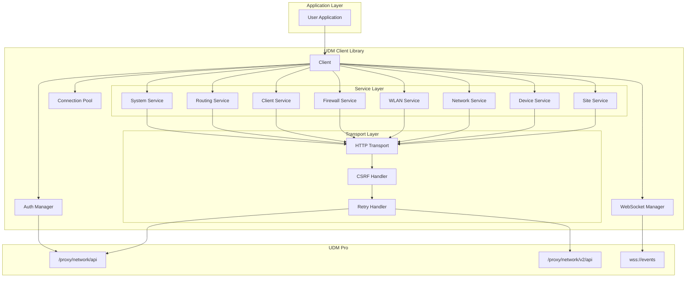
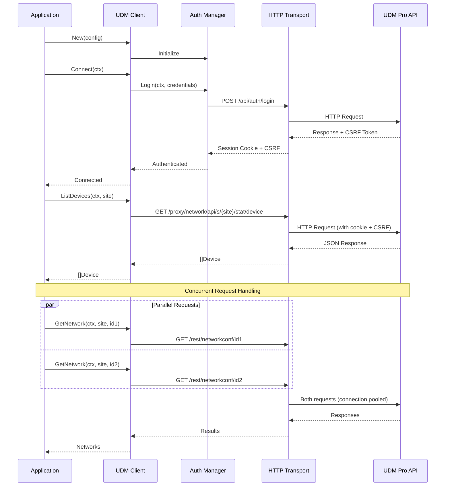
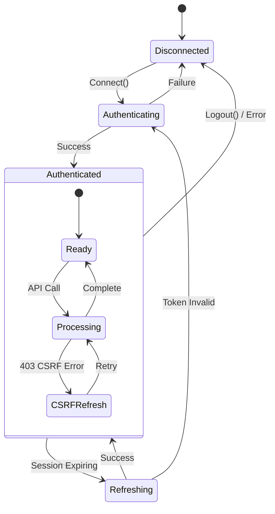
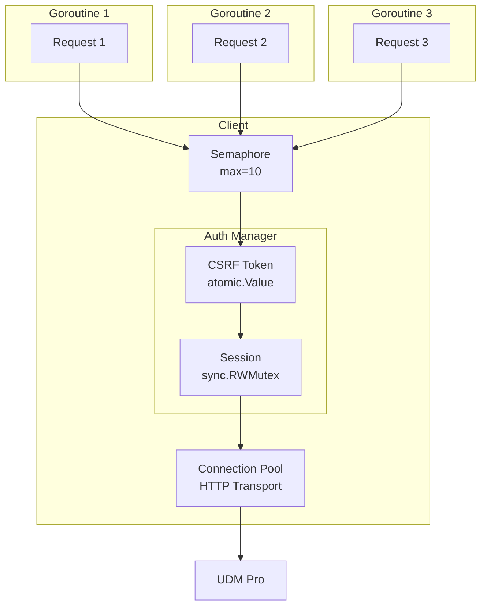
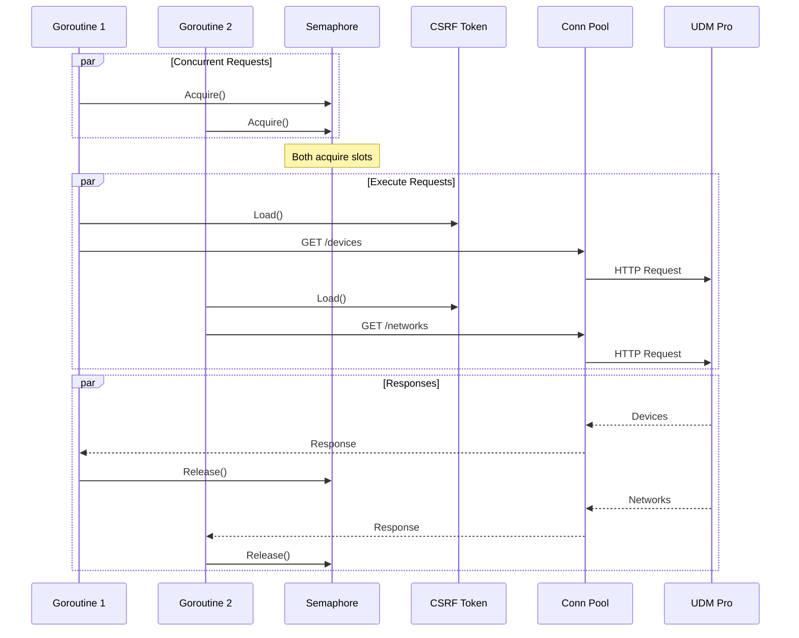
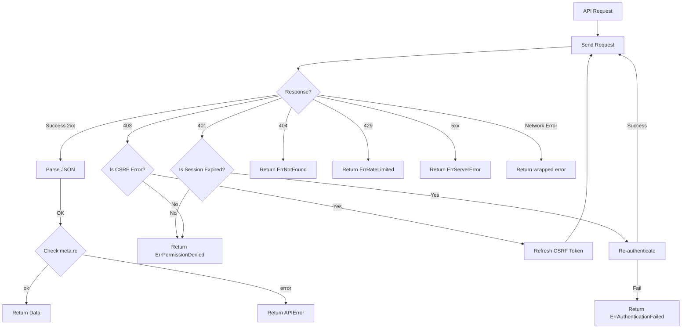
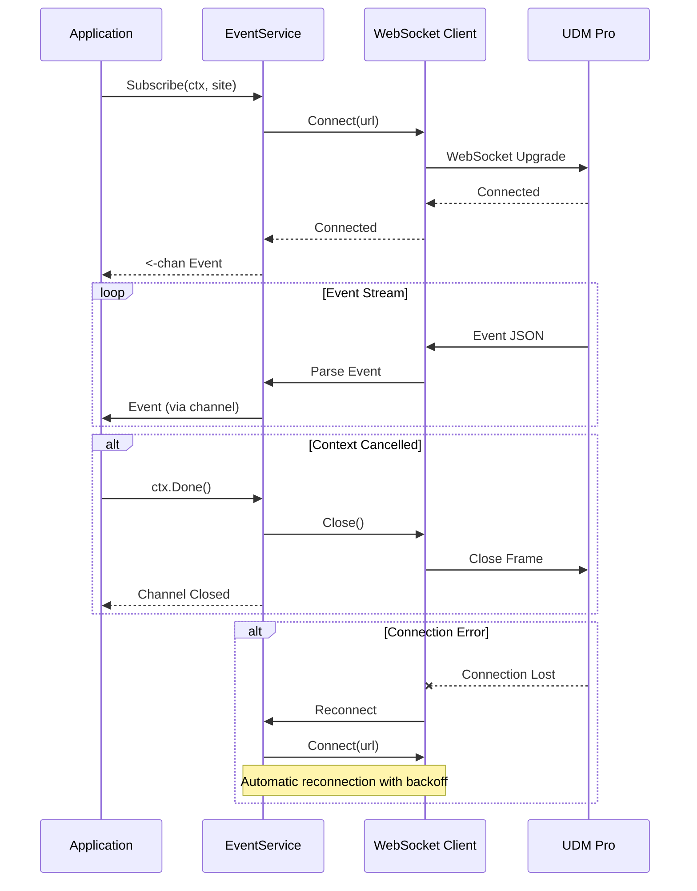
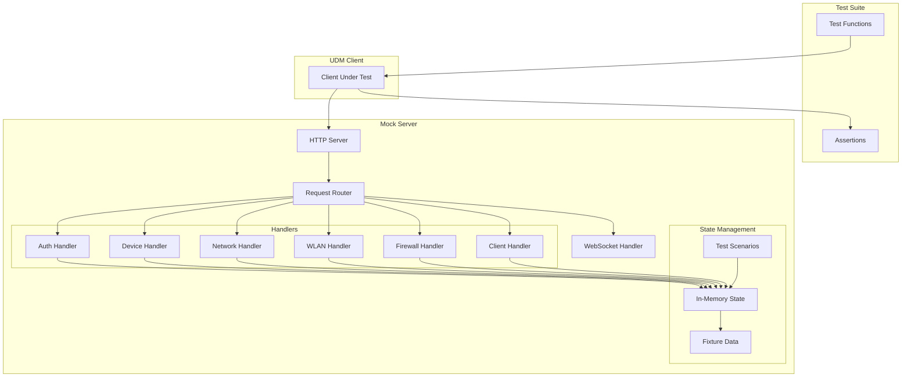

# UniFi UDM Pro Go Client Library - Design Document

## Document Information

| Field | Value |
|-------|-------|
| Version | 1.0.0 |
| Status | Draft |
| Target Go Version | 1.21+ |
| Module Name | `github.com/[org]/udm` |

---

## Table of Contents

1. [Executive Summary](#1-executive-summary)
2. [Goals and Non-Goals](#2-goals-and-non-goals)
3. [Architecture Overview](#3-architecture-overview)
4. [Package Structure](#4-package-structure)
5. [Core Components](#5-core-components)
6. [Concurrency Model](#6-concurrency-model)
7. [API Coverage](#7-api-coverage)
8. [Error Handling](#8-error-handling)
9. [WebSocket Support](#9-websocket-support)
10. [Mock Server Design](#10-mock-server-design)
11. [Testing Strategy](#11-testing-strategy)
12. [Usage Examples](#12-usage-examples)

---

## 1. Executive Summary

This document describes the design of a first-class Go module for programmatic control of Ubiquiti UniFi UDM Pro devices running UniFi OS 4.x/5.x with Network Application 10.x+.

The library focuses on **local control** operations (not monitoring, which is covered by `unpoller/unifi`), providing a complete, type-safe, concurrent-safe API for managing all aspects of a UDM Pro.

### Key Design Principles

1. **Idiomatic Go** - Follow Go conventions, use `context.Context`, proper error handling
2. **Concurrency-Safe** - Support concurrent operations without external synchronization
3. **Testable** - Interface-based design with comprehensive mock server
4. **Complete** - Every documented API endpoint is supported
5. **Ergonomic** - Simple for common cases, flexible for advanced use

---

## 2. Goals and Non-Goals

### Goals

- Complete coverage of UniFi Network Application local API (v1, v2, integrations)
- Thread-safe client supporting concurrent operations
- Context-based cancellation and timeouts
- Automatic session management (login, CSRF token refresh)
- WebSocket support for real-time events
- Comprehensive mock server for testing
- Zero external dependencies beyond standard library (except WebSocket)

### Non-Goals

- Cloud/Site Manager API support (use official Ubiquiti SDK)
- Monitoring/polling functionality (use `unpoller/unifi`)
- UniFi Protect, Access, or Talk APIs
- Legacy controller support (pre-UDM, pre-UniFi OS)
- Code generation from JAR files (unlike `paultyng/go-unifi`)

---

## 3. Architecture Overview

### 3.1 High-Level Architecture



### 3.2 Component Interaction



### 3.3 Authentication Flow



---

## 4. Package Structure

```
github.com/[org]/udm/
├── client.go              # Main client entry point
├── config.go              # Configuration types
├── errors.go              # Error types and handling
├── options.go             # Functional options
├── doc.go                 # Package documentation
│
├── auth/                  # Authentication management
│   ├── auth.go            # Auth manager
│   ├── session.go         # Session handling
│   └── csrf.go            # CSRF token management
│
├── transport/             # HTTP transport layer
│   ├── transport.go       # HTTP client wrapper
│   ├── request.go         # Request building
│   ├── response.go        # Response parsing
│   └── retry.go           # Retry logic
│
├── types/                 # Shared type definitions
│   ├── device.go          # Device types
│   ├── network.go         # Network types
│   ├── wlan.go            # WLAN types
│   ├── firewall.go        # Firewall types
│   ├── client.go          # Client/station types
│   ├── user.go            # User types
│   ├── site.go            # Site types
│   ├── routing.go         # Routing types
│   ├── port.go            # Port types
│   ├── setting.go         # Setting types
│   ├── event.go           # Event types
│   ├── flex.go            # Flexible JSON types (FlexInt, FlexBool)
│   └── common.go          # Common/shared types
│
├── api/                   # API version handling
│   ├── v1/                # v1 API endpoints
│   │   ├── stat.go        # Statistics endpoints
│   │   ├── rest.go        # REST endpoints
│   │   └── cmd.go         # Command endpoints
│   └── v2/                # v2 API endpoints
│       ├── traffic.go     # Traffic rules
│       └── notifications.go
│
├── services/              # Domain services
│   ├── site.go            # Site operations
│   ├── device.go          # Device operations
│   ├── network.go         # Network operations
│   ├── wlan.go            # WLAN operations
│   ├── firewall.go        # Firewall operations
│   ├── client.go          # Client/station operations
│   ├── user.go            # User operations
│   ├── routing.go         # Routing operations
│   ├── portforward.go     # Port forwarding
│   ├── portprofile.go     # Port profiles
│   ├── setting.go         # Settings operations
│   └── system.go          # System operations
│
├── websocket/             # WebSocket support
│   ├── client.go          # WebSocket client
│   ├── events.go          # Event types
│   └── handler.go         # Event handlers
│
├── mock/                  # Mock server for testing
│   ├── server.go          # Mock HTTP server
│   ├── handlers.go        # Request handlers
│   ├── state.go           # Mock state management
│   ├── fixtures/          # Test fixtures
│   │   ├── devices.json
│   │   ├── networks.json
│   │   └── ...
│   └── scenarios/         # Test scenarios
│       ├── basic.go
│       └── error.go
│
├── internal/              # Internal utilities
│   ├── json.go            # JSON helpers
│   ├── mac.go             # MAC address utilities
│   └── url.go             # URL building
│
└── examples/              # Example applications
    ├── basic/
    ├── concurrent/
    └── websocket/
```

---

## 5. Core Components

### 5.1 Client Interface

```go
// Client is the main interface for interacting with a UDM Pro.
type Client interface {
    // Connection management
    Connect(ctx context.Context) error
    Disconnect(ctx context.Context) error
    IsConnected() bool

    // Service accessors
    Sites() SiteService
    Devices() DeviceService
    Networks() NetworkService
    WLANs() WLANService
    Firewall() FirewallService
    Clients() ClientService
    Users() UserService
    Routing() RoutingService
    PortForwards() PortForwardService
    PortProfiles() PortProfileService
    Settings() SettingService
    System() SystemService

    // WebSocket
    Events() EventService

    // Low-level access
    Do(ctx context.Context, req *Request) (*Response, error)
}
```

### 5.2 Configuration

```go
// Config holds the configuration for connecting to a UDM Pro.
type Config struct {
    // Host is the IP address or hostname of the UDM Pro.
    Host string

    // Port is the HTTPS port (default: 443).
    Port int

    // Username for local admin authentication.
    Username string

    // Password for local admin authentication.
    Password string

    // Site is the default site ID (default: "default").
    Site string

    // TLS configuration
    TLSConfig *tls.Config

    // SkipTLSVerify disables TLS certificate verification.
    // WARNING: Only use for development/testing.
    SkipTLSVerify bool

    // Timeout for HTTP requests (default: 30s).
    Timeout time.Duration

    // MaxIdleConns is the maximum number of idle connections (default: 10).
    MaxIdleConns int

    // RetryConfig configures automatic retries.
    RetryConfig *RetryConfig

    // Logger for debug output (optional).
    Logger Logger
}

// RetryConfig configures retry behavior.
type RetryConfig struct {
    // MaxRetries is the maximum number of retries (default: 3).
    MaxRetries int

    // InitialBackoff is the initial backoff duration (default: 100ms).
    InitialBackoff time.Duration

    // MaxBackoff is the maximum backoff duration (default: 5s).
    MaxBackoff time.Duration

    // RetryableErrors are error types that trigger retries.
    RetryableErrors []error
}
```

### 5.3 Functional Options

```go
// Option configures a Client.
type Option func(*clientOptions)

// WithTimeout sets the request timeout.
func WithTimeout(d time.Duration) Option

// WithRetry configures retry behavior.
func WithRetry(maxRetries int, initialBackoff time.Duration) Option

// WithLogger sets a custom logger.
func WithLogger(logger Logger) Option

// WithTLSConfig sets custom TLS configuration.
func WithTLSConfig(config *tls.Config) Option

// WithHTTPClient sets a custom HTTP client.
func WithHTTPClient(client *http.Client) Option

// WithUserAgent sets a custom User-Agent header.
func WithUserAgent(ua string) Option
```

### 5.4 Client Implementation

```go
// client implements the Client interface.
type client struct {
    config     *Config
    httpClient *http.Client
    baseURL    *url.URL

    // Authentication state
    auth       *authManager
    csrfToken  atomic.Value  // string

    // Connection state
    connected  atomic.Bool
    mu         sync.RWMutex

    // Services (lazy initialized)
    sites      *siteService
    devices    *deviceService
    networks   *networkService
    wlans      *wlanService
    firewall   *firewallService
    clients    *clientService
    users      *userService
    routing    *routingService
    portfwds   *portForwardService
    portprofs  *portProfileService
    settings   *settingService
    system     *systemService
    events     *eventService

    // Request semaphore for rate limiting
    sem        *semaphore.Weighted

    // Logger
    logger     Logger
}

// New creates a new UDM Pro client.
func New(config *Config, opts ...Option) (Client, error) {
    // Validate config
    if config.Host == "" {
        return nil, errors.New("host is required")
    }

    // Apply defaults
    if config.Port == 0 {
        config.Port = 443
    }
    if config.Site == "" {
        config.Site = "default"
    }
    if config.Timeout == 0 {
        config.Timeout = 30 * time.Second
    }
    if config.MaxIdleConns == 0 {
        config.MaxIdleConns = 10
    }

    // Apply options
    options := &clientOptions{}
    for _, opt := range opts {
        opt(options)
    }

    // Build base URL
    baseURL := &url.URL{
        Scheme: "https",
        Host:   net.JoinHostPort(config.Host, strconv.Itoa(config.Port)),
    }

    // Create HTTP client with connection pooling
    transport := &http.Transport{
        TLSClientConfig: config.TLSConfig,
        MaxIdleConns:    config.MaxIdleConns,
        MaxConnsPerHost: config.MaxIdleConns,
        IdleConnTimeout: 90 * time.Second,
    }

    if config.SkipTLSVerify {
        if transport.TLSClientConfig == nil {
            transport.TLSClientConfig = &tls.Config{}
        }
        transport.TLSClientConfig.InsecureSkipVerify = true
    }

    jar, _ := cookiejar.New(&cookiejar.Options{
        PublicSuffixList: publicsuffix.List,
    })

    httpClient := &http.Client{
        Transport: transport,
        Jar:       jar,
        Timeout:   config.Timeout,
    }

    c := &client{
        config:     config,
        httpClient: httpClient,
        baseURL:    baseURL,
        auth:       newAuthManager(config.Username, config.Password),
        sem:        semaphore.NewWeighted(int64(config.MaxIdleConns)),
        logger:     options.logger,
    }

    return c, nil
}
```

---

## 6. Concurrency Model

### 6.1 Design Principles

1. **Thread-Safe by Default** - All public methods are safe for concurrent use
2. **No Global State** - Each client instance is independent
3. **Connection Pooling** - HTTP connections are reused efficiently
4. **Request Limiting** - Semaphore prevents overwhelming the UDM
5. **Atomic CSRF Token** - Token updates are lock-free for reads

### 6.2 Concurrency Architecture



### 6.3 Request Flow with Concurrency



### 6.4 CSRF Token Handling

```go
// csrfHandler manages CSRF token updates atomically.
type csrfHandler struct {
    token atomic.Value // string
}

func (h *csrfHandler) Get() string {
    if v := h.token.Load(); v != nil {
        return v.(string)
    }
    return ""
}

func (h *csrfHandler) Set(token string) {
    h.token.Store(token)
}

// Extract CSRF token from response and update atomically
func (h *csrfHandler) UpdateFromResponse(resp *http.Response) {
    if token := resp.Header.Get("X-CSRF-Token"); token != "" {
        h.Set(token)
    }
}
```

### 6.5 Session Refresh Pattern

```go
// authManager handles authentication and session refresh.
type authManager struct {
    username string
    password string

    mu         sync.RWMutex
    loggedIn   bool
    expiresAt  time.Time
    refreshing bool
    refreshCh  chan struct{}
}

// EnsureAuthenticated ensures the session is valid, refreshing if needed.
func (a *authManager) EnsureAuthenticated(ctx context.Context, doLogin func(context.Context) error) error {
    a.mu.RLock()

    // Fast path: session is valid
    if a.loggedIn && time.Now().Before(a.expiresAt.Add(-5*time.Minute)) {
        a.mu.RUnlock()
        return nil
    }

    // Check if another goroutine is already refreshing
    if a.refreshing {
        ch := a.refreshCh
        a.mu.RUnlock()

        // Wait for refresh to complete
        select {
        case <-ch:
            return nil
        case <-ctx.Done():
            return ctx.Err()
        }
    }

    a.mu.RUnlock()

    // Acquire write lock to refresh
    a.mu.Lock()

    // Double-check after acquiring write lock
    if a.loggedIn && time.Now().Before(a.expiresAt.Add(-5*time.Minute)) {
        a.mu.Unlock()
        return nil
    }

    // Mark as refreshing
    a.refreshing = true
    a.refreshCh = make(chan struct{})
    a.mu.Unlock()

    // Perform login
    err := doLogin(ctx)

    // Update state
    a.mu.Lock()
    a.refreshing = false
    close(a.refreshCh)
    if err == nil {
        a.loggedIn = true
        a.expiresAt = time.Now().Add(24 * time.Hour) // Sessions typically last 24h
    }
    a.mu.Unlock()

    return err
}
```

### 6.6 Batch Operations

```go
// BatchResult holds the result of a batch operation.
type BatchResult[T any] struct {
    Value T
    Error error
}

// BatchGet executes multiple GET requests concurrently.
func BatchGet[T any](ctx context.Context, c Client, site string, ids []string,
    getter func(context.Context, string, string) (T, error)) []BatchResult[T] {

    results := make([]BatchResult[T], len(ids))
    var wg sync.WaitGroup

    for i, id := range ids {
        wg.Add(1)
        go func(idx int, id string) {
            defer wg.Done()

            value, err := getter(ctx, site, id)
            results[idx] = BatchResult[T]{Value: value, Error: err}
        }(i, id)
    }

    wg.Wait()
    return results
}

// Example usage:
// results := BatchGet(ctx, client, "default", networkIDs, client.Networks().Get)
```

---

## 7. API Coverage

### 7.1 Service Interface Definitions

#### SiteService

```go
// SiteService provides operations for managing sites.
type SiteService interface {
    // List returns all sites accessible to the current user.
    List(ctx context.Context) ([]types.Site, error)

    // Get returns a specific site by ID.
    Get(ctx context.Context, id string) (*types.Site, error)

    // Create creates a new site.
    Create(ctx context.Context, name, description string) (*types.Site, error)

    // Update updates an existing site.
    Update(ctx context.Context, site *types.Site) (*types.Site, error)

    // Delete deletes a site.
    Delete(ctx context.Context, id string) error

    // Health returns site health status.
    Health(ctx context.Context, site string) ([]types.HealthData, error)

    // SysInfo returns system information for a site.
    SysInfo(ctx context.Context, site string) (*types.SysInfo, error)
}
```

#### DeviceService

```go
// DeviceService provides operations for managing network devices.
type DeviceService interface {
    // List returns all devices in a site.
    List(ctx context.Context, site string) ([]types.Device, error)

    // ListBasic returns basic device info (faster for large deployments).
    ListBasic(ctx context.Context, site string) ([]types.DeviceBasic, error)

    // Get returns a device by ID.
    Get(ctx context.Context, site, id string) (*types.Device, error)

    // GetByMAC returns a device by MAC address.
    GetByMAC(ctx context.Context, site, mac string) (*types.Device, error)

    // Update updates device configuration.
    Update(ctx context.Context, site string, device *types.Device) (*types.Device, error)

    // Adopt adopts a new device.
    Adopt(ctx context.Context, site, mac string) error

    // Forget removes a device from the controller.
    Forget(ctx context.Context, site, mac string) error

    // Restart restarts a device.
    Restart(ctx context.Context, site, mac string) error

    // ForceProvision forces provisioning of a device.
    ForceProvision(ctx context.Context, site, mac string) error

    // Upgrade upgrades device firmware.
    Upgrade(ctx context.Context, site, mac string) error

    // UpgradeExternal upgrades firmware from an external URL.
    UpgradeExternal(ctx context.Context, site, mac, url string) error

    // Locate enables the locate LED on a device.
    Locate(ctx context.Context, site, mac string) error

    // Unlocate disables the locate LED on a device.
    Unlocate(ctx context.Context, site, mac string) error

    // PowerCyclePort cycles PoE power on a switch port.
    PowerCyclePort(ctx context.Context, site, switchMAC string, portIdx int) error

    // SetLEDOverride sets LED override settings.
    SetLEDOverride(ctx context.Context, site, mac string, mode types.LEDMode) error

    // SpectrumScan initiates a spectrum scan on a wireless device.
    SpectrumScan(ctx context.Context, site, mac string) error
}
```

#### NetworkService

```go
// NetworkService provides operations for managing networks.
type NetworkService interface {
    // List returns all networks in a site.
    List(ctx context.Context, site string) ([]types.Network, error)

    // Get returns a network by ID.
    Get(ctx context.Context, site, id string) (*types.Network, error)

    // Create creates a new network.
    Create(ctx context.Context, site string, network *types.Network) (*types.Network, error)

    // Update updates an existing network.
    Update(ctx context.Context, site string, network *types.Network) (*types.Network, error)

    // Delete deletes a network.
    Delete(ctx context.Context, site, id string) error
}
```

#### WLANService

```go
// WLANService provides operations for managing wireless networks.
type WLANService interface {
    // List returns all WLANs in a site.
    List(ctx context.Context, site string) ([]types.WLAN, error)

    // Get returns a WLAN by ID.
    Get(ctx context.Context, site, id string) (*types.WLAN, error)

    // Create creates a new WLAN.
    Create(ctx context.Context, site string, wlan *types.WLAN) (*types.WLAN, error)

    // Update updates an existing WLAN.
    Update(ctx context.Context, site string, wlan *types.WLAN) (*types.WLAN, error)

    // Delete deletes a WLAN.
    Delete(ctx context.Context, site, id string) error

    // Enable enables a WLAN.
    Enable(ctx context.Context, site, id string) error

    // Disable disables a WLAN.
    Disable(ctx context.Context, site, id string) error

    // SetMACFilter configures MAC filtering for a WLAN.
    SetMACFilter(ctx context.Context, site, id string, policy types.MACFilterPolicy, macs []string) error

    // Groups

    // ListGroups returns all WLAN groups.
    ListGroups(ctx context.Context, site string) ([]types.WLANGroup, error)

    // GetGroup returns a WLAN group by ID.
    GetGroup(ctx context.Context, site, id string) (*types.WLANGroup, error)

    // CreateGroup creates a new WLAN group.
    CreateGroup(ctx context.Context, site string, group *types.WLANGroup) (*types.WLANGroup, error)

    // UpdateGroup updates an existing WLAN group.
    UpdateGroup(ctx context.Context, site string, group *types.WLANGroup) (*types.WLANGroup, error)

    // DeleteGroup deletes a WLAN group.
    DeleteGroup(ctx context.Context, site, id string) error
}
```

#### FirewallService

```go
// FirewallService provides operations for managing firewall rules and groups.
type FirewallService interface {
    // Rules

    // ListRules returns all firewall rules in a site.
    ListRules(ctx context.Context, site string) ([]types.FirewallRule, error)

    // GetRule returns a firewall rule by ID.
    GetRule(ctx context.Context, site, id string) (*types.FirewallRule, error)

    // CreateRule creates a new firewall rule.
    CreateRule(ctx context.Context, site string, rule *types.FirewallRule) (*types.FirewallRule, error)

    // UpdateRule updates an existing firewall rule.
    UpdateRule(ctx context.Context, site string, rule *types.FirewallRule) (*types.FirewallRule, error)

    // DeleteRule deletes a firewall rule.
    DeleteRule(ctx context.Context, site, id string) error

    // EnableRule enables a firewall rule.
    EnableRule(ctx context.Context, site, id string) error

    // DisableRule disables a firewall rule.
    DisableRule(ctx context.Context, site, id string) error

    // ReorderRules reorders firewall rules within a ruleset.
    ReorderRules(ctx context.Context, site, ruleset string, updates []types.FirewallRuleIndexUpdate) error

    // Groups

    // ListGroups returns all firewall groups in a site.
    ListGroups(ctx context.Context, site string) ([]types.FirewallGroup, error)

    // GetGroup returns a firewall group by ID.
    GetGroup(ctx context.Context, site, id string) (*types.FirewallGroup, error)

    // CreateGroup creates a new firewall group.
    CreateGroup(ctx context.Context, site string, group *types.FirewallGroup) (*types.FirewallGroup, error)

    // UpdateGroup updates an existing firewall group.
    UpdateGroup(ctx context.Context, site string, group *types.FirewallGroup) (*types.FirewallGroup, error)

    // DeleteGroup deletes a firewall group.
    DeleteGroup(ctx context.Context, site, id string) error

    // Traffic Rules (v2 API)

    // ListTrafficRules returns all traffic rules in a site.
    ListTrafficRules(ctx context.Context, site string) ([]types.TrafficRule, error)

    // GetTrafficRule returns a traffic rule by ID.
    GetTrafficRule(ctx context.Context, site, id string) (*types.TrafficRule, error)

    // CreateTrafficRule creates a new traffic rule.
    CreateTrafficRule(ctx context.Context, site string, rule *types.TrafficRule) (*types.TrafficRule, error)

    // UpdateTrafficRule updates an existing traffic rule.
    UpdateTrafficRule(ctx context.Context, site string, rule *types.TrafficRule) (*types.TrafficRule, error)

    // DeleteTrafficRule deletes a traffic rule.
    DeleteTrafficRule(ctx context.Context, site, id string) error
}
```

#### ClientService

```go
// ClientService provides operations for managing connected clients/stations.
type ClientService interface {
    // ListActive returns all currently connected clients.
    ListActive(ctx context.Context, site string) ([]types.Client, error)

    // ListAll returns all known clients (including historical).
    ListAll(ctx context.Context, site string, opts ...ClientListOption) ([]types.Client, error)

    // Get returns a client by MAC address.
    Get(ctx context.Context, site, mac string) (*types.Client, error)

    // Block blocks a client from the network.
    Block(ctx context.Context, site, mac string) error

    // Unblock unblocks a previously blocked client.
    Unblock(ctx context.Context, site, mac string) error

    // Kick disconnects a client from the network.
    Kick(ctx context.Context, site, mac string) error

    // AuthorizeGuest authorizes a guest client.
    AuthorizeGuest(ctx context.Context, site, mac string, opts ...GuestAuthOption) error

    // UnauthorizeGuest revokes guest authorization.
    UnauthorizeGuest(ctx context.Context, site, mac string) error

    // Forget removes a client from the known clients list.
    Forget(ctx context.Context, site, mac string) error

    // SetFingerprint overrides the device fingerprint.
    SetFingerprint(ctx context.Context, site, mac string, devID int) error
}

// ClientListOption configures client list queries.
type ClientListOption func(*clientListOptions)

// WithinHours limits results to clients seen within the specified hours.
func WithinHours(hours int) ClientListOption

// GuestAuthOption configures guest authorization.
type GuestAuthOption func(*guestAuthOptions)

// WithDuration sets the authorization duration in minutes.
func WithDuration(minutes int) GuestAuthOption

// WithUploadLimit sets the upload bandwidth limit in Kbps.
func WithUploadLimit(kbps int) GuestAuthOption

// WithDownloadLimit sets the download bandwidth limit in Kbps.
func WithDownloadLimit(kbps int) GuestAuthOption

// WithDataLimit sets the data usage limit in bytes.
func WithDataLimit(bytes int64) GuestAuthOption

// WithAPMAC restricts authorization to a specific AP.
func WithAPMAC(mac string) GuestAuthOption
```

#### UserService

```go
// UserService provides operations for managing known/configured clients.
type UserService interface {
    // List returns all known clients/users.
    List(ctx context.Context, site string) ([]types.User, error)

    // Get returns a user by ID.
    Get(ctx context.Context, site, id string) (*types.User, error)

    // GetByMAC returns a user by MAC address.
    GetByMAC(ctx context.Context, site, mac string) (*types.User, error)

    // Create creates a new user entry.
    Create(ctx context.Context, site string, user *types.User) (*types.User, error)

    // Update updates an existing user.
    Update(ctx context.Context, site string, user *types.User) (*types.User, error)

    // Delete deletes a user by ID.
    Delete(ctx context.Context, site, id string) error

    // DeleteByMAC deletes a user by MAC address.
    DeleteByMAC(ctx context.Context, site, mac string) error

    // SetFixedIP assigns a fixed IP to a user.
    SetFixedIP(ctx context.Context, site, mac, ip, networkID string) error

    // ClearFixedIP removes a fixed IP assignment.
    ClearFixedIP(ctx context.Context, site, mac string) error

    // User Groups

    // ListGroups returns all user groups.
    ListGroups(ctx context.Context, site string) ([]types.UserGroup, error)

    // GetGroup returns a user group by ID.
    GetGroup(ctx context.Context, site, id string) (*types.UserGroup, error)

    // CreateGroup creates a new user group.
    CreateGroup(ctx context.Context, site string, group *types.UserGroup) (*types.UserGroup, error)

    // UpdateGroup updates an existing user group.
    UpdateGroup(ctx context.Context, site string, group *types.UserGroup) (*types.UserGroup, error)

    // DeleteGroup deletes a user group.
    DeleteGroup(ctx context.Context, site, id string) error
}
```

#### RoutingService

```go
// RoutingService provides operations for managing static routes.
type RoutingService interface {
    // List returns all static routes in a site.
    List(ctx context.Context, site string) ([]types.Route, error)

    // Get returns a route by ID.
    Get(ctx context.Context, site, id string) (*types.Route, error)

    // Create creates a new static route.
    Create(ctx context.Context, site string, route *types.Route) (*types.Route, error)

    // Update updates an existing route.
    Update(ctx context.Context, site string, route *types.Route) (*types.Route, error)

    // Delete deletes a route.
    Delete(ctx context.Context, site, id string) error

    // Enable enables a route.
    Enable(ctx context.Context, site, id string) error

    // Disable disables a route.
    Disable(ctx context.Context, site, id string) error
}
```

#### PortForwardService

```go
// PortForwardService provides operations for managing port forwarding rules.
type PortForwardService interface {
    // List returns all port forwards in a site.
    List(ctx context.Context, site string) ([]types.PortForward, error)

    // Get returns a port forward by ID.
    Get(ctx context.Context, site, id string) (*types.PortForward, error)

    // Create creates a new port forward.
    Create(ctx context.Context, site string, pf *types.PortForward) (*types.PortForward, error)

    // Update updates an existing port forward.
    Update(ctx context.Context, site string, pf *types.PortForward) (*types.PortForward, error)

    // Delete deletes a port forward.
    Delete(ctx context.Context, site, id string) error

    // Enable enables a port forward.
    Enable(ctx context.Context, site, id string) error

    // Disable disables a port forward.
    Disable(ctx context.Context, site, id string) error
}
```

#### PortProfileService

```go
// PortProfileService provides operations for managing switch port profiles.
type PortProfileService interface {
    // List returns all port profiles in a site.
    List(ctx context.Context, site string) ([]types.PortProfile, error)

    // Get returns a port profile by ID.
    Get(ctx context.Context, site, id string) (*types.PortProfile, error)

    // Create creates a new port profile.
    Create(ctx context.Context, site string, pp *types.PortProfile) (*types.PortProfile, error)

    // Update updates an existing port profile.
    Update(ctx context.Context, site string, pp *types.PortProfile) (*types.PortProfile, error)

    // Delete deletes a port profile.
    Delete(ctx context.Context, site, id string) error
}
```

#### SettingService

```go
// SettingService provides operations for managing site settings.
type SettingService interface {
    // Get returns a setting by key.
    Get(ctx context.Context, site, key string) (*types.Setting, error)

    // Update updates a setting.
    Update(ctx context.Context, site string, setting *types.Setting) (*types.Setting, error)

    // Typed settings accessors

    // GetMgmt returns management settings.
    GetMgmt(ctx context.Context, site string) (*types.SettingMgmt, error)

    // UpdateMgmt updates management settings.
    UpdateMgmt(ctx context.Context, site string, s *types.SettingMgmt) (*types.SettingMgmt, error)

    // GetConnectivity returns connectivity settings.
    GetConnectivity(ctx context.Context, site string) (*types.SettingConnectivity, error)

    // UpdateConnectivity updates connectivity settings.
    UpdateConnectivity(ctx context.Context, site string, s *types.SettingConnectivity) (*types.SettingConnectivity, error)

    // GetCountry returns country/regulatory settings.
    GetCountry(ctx context.Context, site string) (*types.SettingCountry, error)

    // UpdateCountry updates country/regulatory settings.
    UpdateCountry(ctx context.Context, site string, s *types.SettingCountry) (*types.SettingCountry, error)

    // GetGuestAccess returns guest access/portal settings.
    GetGuestAccess(ctx context.Context, site string) (*types.SettingGuestAccess, error)

    // UpdateGuestAccess updates guest access/portal settings.
    UpdateGuestAccess(ctx context.Context, site string, s *types.SettingGuestAccess) (*types.SettingGuestAccess, error)

    // GetDPI returns DPI settings.
    GetDPI(ctx context.Context, site string) (*types.SettingDPI, error)

    // UpdateDPI updates DPI settings.
    UpdateDPI(ctx context.Context, site string, s *types.SettingDPI) (*types.SettingDPI, error)

    // GetIPS returns IPS/IDS settings.
    GetIPS(ctx context.Context, site string) (*types.SettingIPS, error)

    // UpdateIPS updates IPS/IDS settings.
    UpdateIPS(ctx context.Context, site string, s *types.SettingIPS) (*types.SettingIPS, error)

    // GetNTP returns NTP settings.
    GetNTP(ctx context.Context, site string) (*types.SettingNTP, error)

    // UpdateNTP updates NTP settings.
    UpdateNTP(ctx context.Context, site string, s *types.SettingNTP) (*types.SettingNTP, error)

    // GetSNMP returns SNMP settings.
    GetSNMP(ctx context.Context, site string) (*types.SettingSNMP, error)

    // UpdateSNMP updates SNMP settings.
    UpdateSNMP(ctx context.Context, site string, s *types.SettingSNMP) (*types.SettingSNMP, error)

    // GetRsyslog returns remote syslog settings.
    GetRsyslog(ctx context.Context, site string) (*types.SettingRsyslog, error)

    // UpdateRsyslog updates remote syslog settings.
    UpdateRsyslog(ctx context.Context, site string, s *types.SettingRsyslog) (*types.SettingRsyslog, error)

    // RADIUS

    // GetRadius returns RADIUS settings.
    GetRadius(ctx context.Context, site string) (*types.SettingRadius, error)

    // UpdateRadius updates RADIUS settings.
    UpdateRadius(ctx context.Context, site string, s *types.SettingRadius) (*types.SettingRadius, error)

    // ListRadiusProfiles returns all RADIUS profiles.
    ListRadiusProfiles(ctx context.Context, site string) ([]types.RADIUSProfile, error)

    // GetRadiusProfile returns a RADIUS profile by ID.
    GetRadiusProfile(ctx context.Context, site, id string) (*types.RADIUSProfile, error)

    // CreateRadiusProfile creates a new RADIUS profile.
    CreateRadiusProfile(ctx context.Context, site string, p *types.RADIUSProfile) (*types.RADIUSProfile, error)

    // UpdateRadiusProfile updates an existing RADIUS profile.
    UpdateRadiusProfile(ctx context.Context, site string, p *types.RADIUSProfile) (*types.RADIUSProfile, error)

    // DeleteRadiusProfile deletes a RADIUS profile.
    DeleteRadiusProfile(ctx context.Context, site, id string) error

    // Dynamic DNS

    // ListDynamicDNS returns all Dynamic DNS configurations.
    ListDynamicDNS(ctx context.Context, site string) ([]types.DynamicDNS, error)

    // GetDynamicDNS returns a Dynamic DNS configuration by ID.
    GetDynamicDNS(ctx context.Context, site, id string) (*types.DynamicDNS, error)

    // CreateDynamicDNS creates a new Dynamic DNS configuration.
    CreateDynamicDNS(ctx context.Context, site string, d *types.DynamicDNS) (*types.DynamicDNS, error)

    // UpdateDynamicDNS updates an existing Dynamic DNS configuration.
    UpdateDynamicDNS(ctx context.Context, site string, d *types.DynamicDNS) (*types.DynamicDNS, error)

    // DeleteDynamicDNS deletes a Dynamic DNS configuration.
    DeleteDynamicDNS(ctx context.Context, site, id string) error
}
```

#### SystemService

```go
// SystemService provides system-level operations.
type SystemService interface {
    // Status returns controller status (no auth required).
    Status(ctx context.Context) (*types.Status, error)

    // Self returns the current authenticated user's info.
    Self(ctx context.Context) (*types.AdminUser, error)

    // Reboot reboots the controller (requires super admin).
    Reboot(ctx context.Context) error

    // SpeedTest starts a speed test.
    SpeedTest(ctx context.Context, site string) error

    // SpeedTestStatus returns the current speed test status.
    SpeedTestStatus(ctx context.Context, site string) (*types.SpeedTestStatus, error)

    // Backup operations

    // ListBackups returns available automatic backups.
    ListBackups(ctx context.Context) ([]types.Backup, error)

    // CreateBackup creates a new backup.
    CreateBackup(ctx context.Context) error

    // DeleteBackup deletes a backup file.
    DeleteBackup(ctx context.Context, filename string) error

    // DownloadBackup downloads a backup file.
    DownloadBackup(ctx context.Context, filename string) (io.ReadCloser, error)

    // Admin operations

    // ListAdmins returns all admin users.
    ListAdmins(ctx context.Context) ([]types.AdminUser, error)
}
```

#### EventService (WebSocket)

```go
// EventService provides WebSocket-based event streaming.
type EventService interface {
    // Subscribe starts listening for events.
    Subscribe(ctx context.Context, site string) (<-chan Event, error)

    // SubscribeFiltered starts listening for specific event types.
    SubscribeFiltered(ctx context.Context, site string, types ...EventType) (<-chan Event, error)

    // Close closes the WebSocket connection.
    Close() error
}

// EventType represents the type of event.
type EventType string

const (
    EventTypeClientSync     EventType = "sta:sync"
    EventTypeDeviceSync     EventType = "device:sync"
    EventTypeDeviceUpdate   EventType = "device:update"
    EventTypeAlarm          EventType = "alarm"
    EventTypeEvent          EventType = "event"
    EventTypeSpeedTestDone  EventType = "speedtest:done"
    EventTypeBackupDone     EventType = "backup:done"
    EventTypeUpgradeProgress EventType = "upgrade:progress"
)

// Event represents a WebSocket event.
type Event struct {
    Type      EventType
    Timestamp time.Time
    Data      json.RawMessage
}
```

### 7.2 Complete API Endpoint Mapping

| Endpoint | HTTP Method | Service Method |
|----------|-------------|----------------|
| **Authentication** |||
| `/api/auth/login` | POST | `Client.Connect()` |
| `/api/logout` | POST | `Client.Disconnect()` |
| `/status` | GET | `System().Status()` |
| `/api/self` | GET | `System().Self()` |
| `/api/self/sites` | GET | `Sites().List()` |
| **Sites** |||
| `/api/s/{site}/stat/health` | GET | `Sites().Health()` |
| `/api/s/{site}/stat/sysinfo` | GET | `Sites().SysInfo()` |
| `/cmd/sitemgr` (add-site) | POST | `Sites().Create()` |
| `/cmd/sitemgr` (delete-site) | POST | `Sites().Delete()` |
| **Devices** |||
| `/api/s/{site}/stat/device` | GET | `Devices().List()` |
| `/api/s/{site}/stat/device-basic` | GET | `Devices().ListBasic()` |
| `/api/s/{site}/stat/device` | POST | `Devices().Get()` (filtered) |
| `/api/s/{site}/rest/device/{id}` | PUT | `Devices().Update()` |
| `/api/s/{site}/cmd/devmgr` (adopt) | POST | `Devices().Adopt()` |
| `/api/s/{site}/cmd/devmgr` (restart) | POST | `Devices().Restart()` |
| `/api/s/{site}/cmd/devmgr` (force-provision) | POST | `Devices().ForceProvision()` |
| `/api/s/{site}/cmd/devmgr` (upgrade) | POST | `Devices().Upgrade()` |
| `/api/s/{site}/cmd/devmgr` (upgrade-external) | POST | `Devices().UpgradeExternal()` |
| `/api/s/{site}/cmd/devmgr` (set-locate) | POST | `Devices().Locate()` |
| `/api/s/{site}/cmd/devmgr` (unset-locate) | POST | `Devices().Unlocate()` |
| `/api/s/{site}/cmd/devmgr` (power-cycle) | POST | `Devices().PowerCyclePort()` |
| `/api/s/{site}/cmd/devmgr` (spectrum-scan) | POST | `Devices().SpectrumScan()` |
| **Networks** |||
| `/api/s/{site}/rest/networkconf` | GET | `Networks().List()` |
| `/api/s/{site}/rest/networkconf/{id}` | GET | `Networks().Get()` |
| `/api/s/{site}/rest/networkconf` | POST | `Networks().Create()` |
| `/api/s/{site}/rest/networkconf/{id}` | PUT | `Networks().Update()` |
| `/api/s/{site}/rest/networkconf/{id}` | DELETE | `Networks().Delete()` |
| **WLANs** |||
| `/api/s/{site}/rest/wlanconf` | GET | `WLANs().List()` |
| `/api/s/{site}/rest/wlanconf/{id}` | GET | `WLANs().Get()` |
| `/api/s/{site}/rest/wlanconf` | POST | `WLANs().Create()` |
| `/api/s/{site}/rest/wlanconf/{id}` | PUT | `WLANs().Update()` |
| `/api/s/{site}/rest/wlanconf/{id}` | DELETE | `WLANs().Delete()` |
| `/api/s/{site}/rest/wlangroup` | GET | `WLANs().ListGroups()` |
| `/api/s/{site}/rest/wlangroup/{id}` | GET | `WLANs().GetGroup()` |
| `/api/s/{site}/rest/wlangroup` | POST | `WLANs().CreateGroup()` |
| `/api/s/{site}/rest/wlangroup/{id}` | PUT | `WLANs().UpdateGroup()` |
| `/api/s/{site}/rest/wlangroup/{id}` | DELETE | `WLANs().DeleteGroup()` |
| **Firewall** |||
| `/api/s/{site}/rest/firewallrule` | GET | `Firewall().ListRules()` |
| `/api/s/{site}/rest/firewallrule/{id}` | GET | `Firewall().GetRule()` |
| `/api/s/{site}/rest/firewallrule` | POST | `Firewall().CreateRule()` |
| `/api/s/{site}/rest/firewallrule/{id}` | PUT | `Firewall().UpdateRule()` |
| `/api/s/{site}/rest/firewallrule/{id}` | DELETE | `Firewall().DeleteRule()` |
| `/api/s/{site}/cmd/firewall` (reorder) | POST | `Firewall().ReorderRules()` |
| `/api/s/{site}/rest/firewallgroup` | GET | `Firewall().ListGroups()` |
| `/api/s/{site}/rest/firewallgroup/{id}` | GET | `Firewall().GetGroup()` |
| `/api/s/{site}/rest/firewallgroup` | POST | `Firewall().CreateGroup()` |
| `/api/s/{site}/rest/firewallgroup/{id}` | PUT | `Firewall().UpdateGroup()` |
| `/api/s/{site}/rest/firewallgroup/{id}` | DELETE | `Firewall().DeleteGroup()` |
| `/v2/api/site/{site}/trafficrules` | GET | `Firewall().ListTrafficRules()` |
| `/v2/api/site/{site}/trafficrules/{id}` | GET | `Firewall().GetTrafficRule()` |
| `/v2/api/site/{site}/trafficrules` | POST | `Firewall().CreateTrafficRule()` |
| `/v2/api/site/{site}/trafficrules/{id}` | PUT | `Firewall().UpdateTrafficRule()` |
| `/v2/api/site/{site}/trafficrules/{id}` | DELETE | `Firewall().DeleteTrafficRule()` |
| **Clients** |||
| `/api/s/{site}/stat/sta` | GET | `Clients().ListActive()` |
| `/api/s/{site}/stat/alluser` | GET | `Clients().ListAll()` |
| `/api/s/{site}/stat/user/{mac}` | GET | `Clients().Get()` |
| `/api/s/{site}/cmd/stamgr` (block-sta) | POST | `Clients().Block()` |
| `/api/s/{site}/cmd/stamgr` (unblock-sta) | POST | `Clients().Unblock()` |
| `/api/s/{site}/cmd/stamgr` (kick-sta) | POST | `Clients().Kick()` |
| `/api/s/{site}/cmd/stamgr` (forget-sta) | POST | `Clients().Forget()` |
| `/api/s/{site}/cmd/stamgr` (authorize-guest) | POST | `Clients().AuthorizeGuest()` |
| `/api/s/{site}/cmd/stamgr` (unauthorize-guest) | POST | `Clients().UnauthorizeGuest()` |
| **Users (Known Clients)** |||
| `/api/s/{site}/rest/user` | GET | `Users().List()` |
| `/api/s/{site}/rest/user/{id}` | GET | `Users().Get()` |
| `/api/s/{site}/rest/user` | POST | `Users().Create()` |
| `/api/s/{site}/rest/user/{id}` | PUT | `Users().Update()` |
| `/api/s/{site}/rest/user/{id}` | DELETE | `Users().Delete()` |
| `/api/s/{site}/rest/usergroup` | GET | `Users().ListGroups()` |
| `/api/s/{site}/rest/usergroup/{id}` | GET | `Users().GetGroup()` |
| `/api/s/{site}/rest/usergroup` | POST | `Users().CreateGroup()` |
| `/api/s/{site}/rest/usergroup/{id}` | PUT | `Users().UpdateGroup()` |
| `/api/s/{site}/rest/usergroup/{id}` | DELETE | `Users().DeleteGroup()` |
| **Routing** |||
| `/api/s/{site}/rest/routing` | GET | `Routing().List()` |
| `/api/s/{site}/rest/routing/{id}` | GET | `Routing().Get()` |
| `/api/s/{site}/rest/routing` | POST | `Routing().Create()` |
| `/api/s/{site}/rest/routing/{id}` | PUT | `Routing().Update()` |
| `/api/s/{site}/rest/routing/{id}` | DELETE | `Routing().Delete()` |
| **Port Forwarding** |||
| `/api/s/{site}/rest/portforward` | GET | `PortForwards().List()` |
| `/api/s/{site}/rest/portforward/{id}` | GET | `PortForwards().Get()` |
| `/api/s/{site}/rest/portforward` | POST | `PortForwards().Create()` |
| `/api/s/{site}/rest/portforward/{id}` | PUT | `PortForwards().Update()` |
| `/api/s/{site}/rest/portforward/{id}` | DELETE | `PortForwards().Delete()` |
| **Port Profiles** |||
| `/api/s/{site}/rest/portconf` | GET | `PortProfiles().List()` |
| `/api/s/{site}/rest/portconf/{id}` | GET | `PortProfiles().Get()` |
| `/api/s/{site}/rest/portconf` | POST | `PortProfiles().Create()` |
| `/api/s/{site}/rest/portconf/{id}` | PUT | `PortProfiles().Update()` |
| `/api/s/{site}/rest/portconf/{id}` | DELETE | `PortProfiles().Delete()` |
| **Settings** |||
| `/api/s/{site}/rest/setting` | GET | `Settings().Get()` (all) |
| `/api/s/{site}/rest/setting/{key}` | PUT | `Settings().Update()` |
| `/api/s/{site}/rest/radiusprofile` | GET | `Settings().ListRadiusProfiles()` |
| `/api/s/{site}/rest/radiusprofile/{id}` | GET | `Settings().GetRadiusProfile()` |
| `/api/s/{site}/rest/radiusprofile` | POST | `Settings().CreateRadiusProfile()` |
| `/api/s/{site}/rest/radiusprofile/{id}` | PUT | `Settings().UpdateRadiusProfile()` |
| `/api/s/{site}/rest/radiusprofile/{id}` | DELETE | `Settings().DeleteRadiusProfile()` |
| `/api/s/{site}/rest/dynamicdns` | GET | `Settings().ListDynamicDNS()` |
| `/api/s/{site}/rest/dynamicdns/{id}` | GET | `Settings().GetDynamicDNS()` |
| `/api/s/{site}/rest/dynamicdns` | POST | `Settings().CreateDynamicDNS()` |
| `/api/s/{site}/rest/dynamicdns/{id}` | PUT | `Settings().UpdateDynamicDNS()` |
| `/api/s/{site}/rest/dynamicdns/{id}` | DELETE | `Settings().DeleteDynamicDNS()` |
| **System** |||
| `/api/system/reboot` | POST | `System().Reboot()` |
| `/api/s/{site}/cmd/devmgr` (speedtest) | POST | `System().SpeedTest()` |
| `/api/s/{site}/cmd/devmgr` (speedtest-status) | POST | `System().SpeedTestStatus()` |
| `/api/s/{site}/cmd/backup` (list-backups) | POST | `System().ListBackups()` |
| `/api/s/{site}/cmd/backup` (delete-backup) | POST | `System().DeleteBackup()` |
| `/api/stat/admin` | GET | `System().ListAdmins()` |
| **WebSocket** |||
| `wss://{host}/proxy/network/wss/s/{site}/events` | WS | `Events().Subscribe()` |

---

## 8. Error Handling

### 8.1 Error Types

```go
package udm

import "errors"

// Sentinel errors for common conditions.
var (
    // ErrNotConnected indicates the client is not connected.
    ErrNotConnected = errors.New("udm: not connected")

    // ErrAlreadyConnected indicates the client is already connected.
    ErrAlreadyConnected = errors.New("udm: already connected")

    // ErrAuthenticationFailed indicates login failed.
    ErrAuthenticationFailed = errors.New("udm: authentication failed")

    // ErrSessionExpired indicates the session has expired.
    ErrSessionExpired = errors.New("udm: session expired")

    // ErrInvalidCSRFToken indicates the CSRF token is invalid.
    ErrInvalidCSRFToken = errors.New("udm: invalid CSRF token")

    // ErrNotFound indicates the requested resource was not found.
    ErrNotFound = errors.New("udm: not found")

    // ErrPermissionDenied indicates insufficient permissions.
    ErrPermissionDenied = errors.New("udm: permission denied")

    // ErrAlreadyExists indicates the resource already exists.
    ErrAlreadyExists = errors.New("udm: already exists")

    // ErrInvalidRequest indicates the request was malformed.
    ErrInvalidRequest = errors.New("udm: invalid request")

    // ErrRateLimited indicates rate limiting is in effect.
    ErrRateLimited = errors.New("udm: rate limited")

    // ErrServerError indicates a server-side error.
    ErrServerError = errors.New("udm: server error")
)

// APIError represents an error returned by the UniFi API.
type APIError struct {
    StatusCode int
    RC         string // Return code from API
    Message    string // Error message from API
    Endpoint   string // API endpoint that was called
}

func (e *APIError) Error() string {
    return fmt.Sprintf("udm: API error %d on %s: [%s] %s",
        e.StatusCode, e.Endpoint, e.RC, e.Message)
}

// Is implements errors.Is for APIError.
func (e *APIError) Is(target error) bool {
    switch target {
    case ErrNotFound:
        return e.StatusCode == 404
    case ErrPermissionDenied:
        return e.StatusCode == 403 && !strings.Contains(e.Message, "CSRF")
    case ErrInvalidCSRFToken:
        return e.StatusCode == 403 && strings.Contains(e.Message, "CSRF")
    case ErrAuthenticationFailed, ErrSessionExpired:
        return e.StatusCode == 401 || e.RC == "error" && e.Message == "api.err.LoginRequired"
    case ErrAlreadyExists:
        return e.RC == "error" && e.Message == "api.err.AlreadyExists"
    case ErrInvalidRequest:
        return e.StatusCode == 400
    case ErrRateLimited:
        return e.StatusCode == 429
    case ErrServerError:
        return e.StatusCode >= 500
    }
    return false
}

// Unwrap returns the underlying error for error wrapping.
func (e *APIError) Unwrap() error {
    switch {
    case e.Is(ErrNotFound):
        return ErrNotFound
    case e.Is(ErrPermissionDenied):
        return ErrPermissionDenied
    case e.Is(ErrInvalidCSRFToken):
        return ErrInvalidCSRFToken
    case e.Is(ErrSessionExpired):
        return ErrSessionExpired
    case e.Is(ErrAlreadyExists):
        return ErrAlreadyExists
    case e.Is(ErrInvalidRequest):
        return ErrInvalidRequest
    case e.Is(ErrRateLimited):
        return ErrRateLimited
    case e.Is(ErrServerError):
        return ErrServerError
    default:
        return nil
    }
}

// ValidationError represents a client-side validation error.
type ValidationError struct {
    Field   string
    Message string
}

func (e *ValidationError) Error() string {
    return fmt.Sprintf("udm: validation error on %s: %s", e.Field, e.Message)
}
```

### 8.2 Error Handling Flow



---

## 9. WebSocket Support

### 9.1 WebSocket Architecture



### 9.2 WebSocket Implementation

```go
// eventService implements EventService.
type eventService struct {
    client    *client
    conn      *websocket.Conn
    mu        sync.Mutex
    closed    bool
    reconnect bool
}

// Subscribe starts listening for events on the specified site.
func (s *eventService) Subscribe(ctx context.Context, site string) (<-chan Event, error) {
    s.mu.Lock()
    defer s.mu.Unlock()

    if s.conn != nil {
        return nil, errors.New("already subscribed")
    }

    // Build WebSocket URL
    u := url.URL{
        Scheme: "wss",
        Host:   s.client.baseURL.Host,
        Path:   fmt.Sprintf("/proxy/network/wss/s/%s/events", site),
    }

    // Get cookies for authentication
    cookies := s.client.httpClient.Jar.Cookies(s.client.baseURL)
    header := http.Header{}
    for _, c := range cookies {
        header.Add("Cookie", c.String())
    }

    // Create dialer with TLS config
    dialer := websocket.Dialer{
        TLSClientConfig: s.client.httpClient.Transport.(*http.Transport).TLSClientConfig,
    }

    // Connect
    conn, _, err := dialer.DialContext(ctx, u.String(), header)
    if err != nil {
        return nil, fmt.Errorf("websocket connect: %w", err)
    }

    s.conn = conn
    s.closed = false
    s.reconnect = true

    // Create event channel
    events := make(chan Event, 100)

    // Start reader goroutine
    go s.readLoop(ctx, site, events)

    return events, nil
}

func (s *eventService) readLoop(ctx context.Context, site string, events chan<- Event) {
    defer close(events)

    for {
        select {
        case <-ctx.Done():
            s.Close()
            return
        default:
        }

        s.mu.Lock()
        conn := s.conn
        s.mu.Unlock()

        if conn == nil {
            return
        }

        _, message, err := conn.ReadMessage()
        if err != nil {
            if s.reconnect && !s.closed {
                // Attempt reconnection
                if err := s.reconnectWithBackoff(ctx, site); err != nil {
                    return
                }
                continue
            }
            return
        }

        // Parse event
        var wsEvent struct {
            Meta struct {
                Message string `json:"message"`
                RC      string `json:"rc"`
            } `json:"meta"`
            Data []json.RawMessage `json:"data"`
        }

        if err := json.Unmarshal(message, &wsEvent); err != nil {
            continue
        }

        // Send events
        for _, data := range wsEvent.Data {
            event := Event{
                Type:      EventType(wsEvent.Meta.Message),
                Timestamp: time.Now(),
                Data:      data,
            }

            select {
            case events <- event:
            case <-ctx.Done():
                return
            }
        }
    }
}
```

---

## 10. Mock Server Design

### 10.1 Mock Server Architecture



### 10.2 Mock Server Implementation

```go
package mock

import (
    "encoding/json"
    "net/http"
    "net/http/httptest"
    "sync"

    "github.com/[org]/udm/types"
)

// Server is a mock UDM Pro server for testing.
type Server struct {
    *httptest.Server

    mu    sync.RWMutex
    state *State

    // Configuration
    authEnabled bool
    csrfEnabled bool

    // Hooks for custom behavior
    OnRequest  func(r *http.Request)
    OnResponse func(r *http.Request, status int)
}

// State holds the mock server's state.
type State struct {
    mu sync.RWMutex

    // Authentication state
    Sessions map[string]*Session
    CSRFToken string

    // Data stores
    Sites        map[string]*types.Site
    Devices      map[string]map[string]*types.Device      // site -> id -> device
    Networks     map[string]map[string]*types.Network     // site -> id -> network
    WLANs        map[string]map[string]*types.WLAN        // site -> id -> wlan
    FirewallRules map[string]map[string]*types.FirewallRule
    FirewallGroups map[string]map[string]*types.FirewallGroup
    TrafficRules map[string]map[string]*types.TrafficRule
    Clients      map[string]map[string]*types.Client      // site -> mac -> client
    Users        map[string]map[string]*types.User        // site -> id -> user
    Routes       map[string]map[string]*types.Route
    PortForwards map[string]map[string]*types.PortForward
    PortProfiles map[string]map[string]*types.PortProfile
    Settings     map[string]map[string]*types.Setting     // site -> key -> setting

    // Events for WebSocket
    EventQueue []types.Event
}

// Session represents an authenticated session.
type Session struct {
    Token     string
    Username  string
    ExpiresAt time.Time
}

// NewServer creates a new mock UDM Pro server.
func NewServer(opts ...Option) *Server {
    s := &Server{
        state: NewState(),
        authEnabled: true,
        csrfEnabled: true,
    }

    for _, opt := range opts {
        opt(s)
    }

    mux := http.NewServeMux()
    s.registerRoutes(mux)

    s.Server = httptest.NewTLSServer(mux)
    return s
}

// Option configures a mock server.
type Option func(*Server)

// WithoutAuth disables authentication checks.
func WithoutAuth() Option {
    return func(s *Server) {
        s.authEnabled = false
    }
}

// WithoutCSRF disables CSRF token checks.
func WithoutCSRF() Option {
    return func(s *Server) {
        s.csrfEnabled = false
    }
}

// WithFixtures loads fixtures into the server state.
func WithFixtures(fixtures *Fixtures) Option {
    return func(s *Server) {
        s.state.LoadFixtures(fixtures)
    }
}

// WithScenario configures a specific test scenario.
func WithScenario(scenario Scenario) Option {
    return func(s *Server) {
        scenario.Apply(s.state)
    }
}

func (s *Server) registerRoutes(mux *http.ServeMux) {
    // Authentication
    mux.HandleFunc("/api/auth/login", s.handleLogin)
    mux.HandleFunc("/api/logout", s.handleLogout)
    mux.HandleFunc("/status", s.handleStatus)

    // Sites
    mux.HandleFunc("/proxy/network/api/self/sites", s.handleListSites)
    mux.HandleFunc("/proxy/network/api/s/", s.handleSiteRequest)

    // v2 API
    mux.HandleFunc("/proxy/network/v2/api/site/", s.handleV2Request)

    // WebSocket
    mux.HandleFunc("/proxy/network/wss/", s.handleWebSocket)
}

// handleLogin processes login requests.
func (s *Server) handleLogin(w http.ResponseWriter, r *http.Request) {
    if r.Method != http.MethodPost {
        http.Error(w, "method not allowed", http.StatusMethodNotAllowed)
        return
    }

    var req struct {
        Username string `json:"username"`
        Password string `json:"password"`
    }

    if err := json.NewDecoder(r.Body).Decode(&req); err != nil {
        s.writeError(w, http.StatusBadRequest, "invalid request")
        return
    }

    // Simple validation (customize as needed)
    if req.Username == "" || req.Password == "" {
        s.writeError(w, http.StatusUnauthorized, "invalid credentials")
        return
    }

    // Create session
    token := generateToken()
    csrf := generateToken()

    s.state.mu.Lock()
    s.state.Sessions[token] = &Session{
        Token:     token,
        Username:  req.Username,
        ExpiresAt: time.Now().Add(24 * time.Hour),
    }
    s.state.CSRFToken = csrf
    s.state.mu.Unlock()

    // Set cookies
    http.SetCookie(w, &http.Cookie{
        Name:     "TOKEN",
        Value:    token,
        Path:     "/",
        HttpOnly: true,
        Secure:   true,
    })

    // Set CSRF token header
    w.Header().Set("X-CSRF-Token", csrf)

    // Return user info
    s.writeJSON(w, http.StatusOK, map[string]interface{}{
        "unique_id":      "mock-user-id",
        "username":       req.Username,
        "isSuperAdmin":   true,
    })
}

// handleSiteRequest routes site-specific API requests.
func (s *Server) handleSiteRequest(w http.ResponseWriter, r *http.Request) {
    // Verify authentication
    if s.authEnabled && !s.isAuthenticated(r) {
        s.writeAPIError(w, http.StatusUnauthorized, "api.err.LoginRequired")
        return
    }

    // Verify CSRF token for write operations
    if s.csrfEnabled && r.Method != http.MethodGet {
        if !s.isValidCSRF(r) {
            w.WriteHeader(http.StatusForbidden)
            json.NewEncoder(w).Encode(map[string]string{
                "message": "Invalid CSRF Token",
            })
            return
        }
    }

    // Parse path: /proxy/network/api/s/{site}/{endpoint...}
    path := strings.TrimPrefix(r.URL.Path, "/proxy/network/api/s/")
    parts := strings.SplitN(path, "/", 2)
    if len(parts) < 2 {
        http.NotFound(w, r)
        return
    }

    site := parts[0]
    endpoint := parts[1]

    // Route to handler
    switch {
    case strings.HasPrefix(endpoint, "stat/device"):
        s.handleDeviceStat(w, r, site, endpoint)
    case strings.HasPrefix(endpoint, "stat/sta"):
        s.handleClientStat(w, r, site)
    case strings.HasPrefix(endpoint, "stat/health"):
        s.handleHealth(w, r, site)
    case strings.HasPrefix(endpoint, "rest/networkconf"):
        s.handleNetworkREST(w, r, site, endpoint)
    case strings.HasPrefix(endpoint, "rest/wlanconf"):
        s.handleWLANREST(w, r, site, endpoint)
    case strings.HasPrefix(endpoint, "rest/firewallrule"):
        s.handleFirewallRuleREST(w, r, site, endpoint)
    case strings.HasPrefix(endpoint, "rest/firewallgroup"):
        s.handleFirewallGroupREST(w, r, site, endpoint)
    case strings.HasPrefix(endpoint, "rest/user"):
        s.handleUserREST(w, r, site, endpoint)
    case strings.HasPrefix(endpoint, "rest/routing"):
        s.handleRoutingREST(w, r, site, endpoint)
    case strings.HasPrefix(endpoint, "rest/portforward"):
        s.handlePortForwardREST(w, r, site, endpoint)
    case strings.HasPrefix(endpoint, "rest/portconf"):
        s.handlePortProfileREST(w, r, site, endpoint)
    case strings.HasPrefix(endpoint, "rest/setting"):
        s.handleSettingREST(w, r, site, endpoint)
    case strings.HasPrefix(endpoint, "cmd/devmgr"):
        s.handleDeviceCommand(w, r, site)
    case strings.HasPrefix(endpoint, "cmd/stamgr"):
        s.handleClientCommand(w, r, site)
    default:
        http.NotFound(w, r)
    }
}

// writeAPIResponse writes a standard API response.
func (s *Server) writeAPIResponse(w http.ResponseWriter, data interface{}) {
    s.writeJSON(w, http.StatusOK, map[string]interface{}{
        "meta": map[string]string{"rc": "ok"},
        "data": data,
    })
}

// writeAPIError writes an API error response.
func (s *Server) writeAPIError(w http.ResponseWriter, status int, msg string) {
    w.WriteHeader(status)
    json.NewEncoder(w).Encode(map[string]interface{}{
        "meta": map[string]string{"rc": "error", "msg": msg},
        "data": []interface{}{},
    })
}
```

### 10.3 Fixtures and Scenarios

```go
package mock

// Fixtures contains pre-configured test data.
type Fixtures struct {
    Sites        []*types.Site
    Devices      map[string][]*types.Device // site -> devices
    Networks     map[string][]*types.Network
    WLANs        map[string][]*types.WLAN
    // ... other types
}

// LoadFixtures loads fixture data from JSON files.
func LoadFixtures(dir string) (*Fixtures, error) {
    // Load from JSON files in directory
    // ...
}

// DefaultFixtures returns standard test fixtures.
func DefaultFixtures() *Fixtures {
    return &Fixtures{
        Sites: []*types.Site{
            {
                ID:   "default",
                Name: "default",
                Desc: "Default Site",
            },
        },
        Devices: map[string][]*types.Device{
            "default": {
                {
                    ID:      "device-1",
                    MAC:     "00:11:22:33:44:55",
                    Name:    "Test AP",
                    Model:   "U6-Pro",
                    Type:    "uap",
                    State:   1,
                    Adopted: true,
                },
                {
                    ID:      "device-2",
                    MAC:     "aa:bb:cc:dd:ee:ff",
                    Name:    "Test Switch",
                    Model:   "USW-24-PoE",
                    Type:    "usw",
                    State:   1,
                    Adopted: true,
                },
            },
        },
        Networks: map[string][]*types.Network{
            "default": {
                {
                    ID:           "network-1",
                    Name:         "Default",
                    Purpose:      "corporate",
                    IPSubnet:     "192.168.1.0/24",
                    VLANEnabled:  false,
                    DHCPDEnabled: true,
                    Enabled:      true,
                },
            },
        },
        // ... more fixtures
    }
}

// Scenario defines a test scenario.
type Scenario interface {
    Apply(*State)
}

// ErrorScenario simulates various error conditions.
type ErrorScenario struct {
    Endpoint   string
    Method     string
    StatusCode int
    Message    string
    Count      int // Number of times to return error (0 = always)
}

func (s ErrorScenario) Apply(state *State) {
    // Register error condition in state
    state.mu.Lock()
    defer state.mu.Unlock()
    // ...
}

// Predefined scenarios
var (
    // ScenarioSessionExpired simulates session expiration.
    ScenarioSessionExpired = ErrorScenario{
        Endpoint:   "*",
        StatusCode: 401,
        Message:    "api.err.LoginRequired",
        Count:      1,
    }

    // ScenarioCSRFFailure simulates CSRF token mismatch.
    ScenarioCSRFFailure = ErrorScenario{
        Endpoint:   "*",
        Method:     "POST",
        StatusCode: 403,
        Message:    "Invalid CSRF Token",
        Count:      1,
    }

    // ScenarioRateLimit simulates rate limiting.
    ScenarioRateLimit = ErrorScenario{
        Endpoint:   "*",
        StatusCode: 429,
        Message:    "rate limited",
        Count:      3,
    }
)
```

### 10.4 WebSocket Mock

```go
package mock

import (
    "net/http"
    "sync"

    "github.com/gorilla/websocket"
)

// handleWebSocket handles WebSocket connections.
func (s *Server) handleWebSocket(w http.ResponseWriter, r *http.Request) {
    // Verify authentication via cookie
    if s.authEnabled && !s.isAuthenticated(r) {
        http.Error(w, "unauthorized", http.StatusUnauthorized)
        return
    }

    upgrader := websocket.Upgrader{
        CheckOrigin: func(r *http.Request) bool { return true },
    }

    conn, err := upgrader.Upgrade(w, r, nil)
    if err != nil {
        return
    }

    // Register connection
    s.mu.Lock()
    s.wsConns = append(s.wsConns, conn)
    s.mu.Unlock()

    // Keep connection open until client disconnects
    defer func() {
        conn.Close()
        s.mu.Lock()
        for i, c := range s.wsConns {
            if c == conn {
                s.wsConns = append(s.wsConns[:i], s.wsConns[i+1:]...)
                break
            }
        }
        s.mu.Unlock()
    }()

    // Read messages (keep alive)
    for {
        if _, _, err := conn.ReadMessage(); err != nil {
            return
        }
    }
}

// BroadcastEvent sends an event to all connected WebSocket clients.
func (s *Server) BroadcastEvent(event types.Event) {
    msg, _ := json.Marshal(map[string]interface{}{
        "meta": map[string]string{
            "message": string(event.Type),
            "rc":      "ok",
        },
        "data": []interface{}{event.Data},
    })

    s.mu.RLock()
    defer s.mu.RUnlock()

    for _, conn := range s.wsConns {
        conn.WriteMessage(websocket.TextMessage, msg)
    }
}

// SimulateClientConnect simulates a client connecting to the network.
func (s *Server) SimulateClientConnect(site string, client *types.Client) {
    // Add to state
    s.state.mu.Lock()
    if s.state.Clients[site] == nil {
        s.state.Clients[site] = make(map[string]*types.Client)
    }
    s.state.Clients[site][client.MAC] = client
    s.state.mu.Unlock()

    // Broadcast event
    s.BroadcastEvent(types.Event{
        Type: types.EventTypeClientSync,
        Data: client,
    })
}
```

---

## 11. Testing Strategy

### 11.1 Test Structure

```
tests/
├── unit/                  # Unit tests
│   ├── auth_test.go
│   ├── transport_test.go
│   └── types_test.go
│
├── integration/           # Integration tests with mock
│   ├── client_test.go
│   ├── device_test.go
│   ├── network_test.go
│   ├── wlan_test.go
│   ├── firewall_test.go
│   └── websocket_test.go
│
├── e2e/                   # End-to-end tests (real UDM)
│   └── smoke_test.go
│
└── fixtures/              # Shared test fixtures
    ├── devices.json
    ├── networks.json
    └── ...
```

### 11.2 Test Example

```go
package integration_test

import (
    "context"
    "testing"
    "time"

    "github.com/[org]/udm"
    "github.com/[org]/udm/mock"
    "github.com/stretchr/testify/assert"
    "github.com/stretchr/testify/require"
)

func TestClient_ListDevices(t *testing.T) {
    // Create mock server with fixtures
    server := mock.NewServer(
        mock.WithFixtures(mock.DefaultFixtures()),
    )
    defer server.Close()

    // Create client
    client, err := udm.New(&udm.Config{
        Host:          server.Host(),
        Username:      "admin",
        Password:      "password",
        SkipTLSVerify: true,
    })
    require.NoError(t, err)

    // Connect
    ctx := context.Background()
    err = client.Connect(ctx)
    require.NoError(t, err)
    defer client.Disconnect(ctx)

    // List devices
    devices, err := client.Devices().List(ctx, "default")
    require.NoError(t, err)

    assert.Len(t, devices, 2)
    assert.Equal(t, "Test AP", devices[0].Name)
    assert.Equal(t, "Test Switch", devices[1].Name)
}

func TestClient_CreateNetwork(t *testing.T) {
    server := mock.NewServer(mock.WithFixtures(mock.DefaultFixtures()))
    defer server.Close()

    client, _ := udm.New(&udm.Config{
        Host:          server.Host(),
        Username:      "admin",
        Password:      "password",
        SkipTLSVerify: true,
    })

    ctx := context.Background()
    _ = client.Connect(ctx)
    defer client.Disconnect(ctx)

    // Create network
    network := &types.Network{
        Name:         "Test Network",
        Purpose:      "corporate",
        IPSubnet:     "10.0.0.0/24",
        VLANEnabled:  true,
        VLAN:         100,
        DHCPDEnabled: true,
        Enabled:      true,
    }

    created, err := client.Networks().Create(ctx, "default", network)
    require.NoError(t, err)

    assert.NotEmpty(t, created.ID)
    assert.Equal(t, "Test Network", created.Name)
    assert.Equal(t, 100, created.VLAN)
}

func TestClient_ConcurrentRequests(t *testing.T) {
    server := mock.NewServer(mock.WithFixtures(mock.DefaultFixtures()))
    defer server.Close()

    client, _ := udm.New(&udm.Config{
        Host:          server.Host(),
        Username:      "admin",
        Password:      "password",
        SkipTLSVerify: true,
    })

    ctx := context.Background()
    _ = client.Connect(ctx)
    defer client.Disconnect(ctx)

    // Run multiple requests concurrently
    var wg sync.WaitGroup
    errors := make(chan error, 10)

    for i := 0; i < 10; i++ {
        wg.Add(1)
        go func() {
            defer wg.Done()
            _, err := client.Devices().List(ctx, "default")
            if err != nil {
                errors <- err
            }
        }()
    }

    wg.Wait()
    close(errors)

    for err := range errors {
        t.Errorf("concurrent request failed: %v", err)
    }
}

func TestClient_SessionRefresh(t *testing.T) {
    server := mock.NewServer(
        mock.WithFixtures(mock.DefaultFixtures()),
        mock.WithScenario(mock.ScenarioSessionExpired),
    )
    defer server.Close()

    client, _ := udm.New(&udm.Config{
        Host:          server.Host(),
        Username:      "admin",
        Password:      "password",
        SkipTLSVerify: true,
    })

    ctx := context.Background()
    _ = client.Connect(ctx)
    defer client.Disconnect(ctx)

    // First request should trigger re-auth and succeed
    devices, err := client.Devices().List(ctx, "default")
    require.NoError(t, err)
    assert.NotEmpty(t, devices)
}

func TestClient_WebSocket(t *testing.T) {
    server := mock.NewServer(mock.WithFixtures(mock.DefaultFixtures()))
    defer server.Close()

    client, _ := udm.New(&udm.Config{
        Host:          server.Host(),
        Username:      "admin",
        Password:      "password",
        SkipTLSVerify: true,
    })

    ctx, cancel := context.WithTimeout(context.Background(), 5*time.Second)
    defer cancel()

    _ = client.Connect(ctx)
    defer client.Disconnect(ctx)

    // Subscribe to events
    events, err := client.Events().Subscribe(ctx, "default")
    require.NoError(t, err)

    // Simulate client connect
    go func() {
        time.Sleep(100 * time.Millisecond)
        server.SimulateClientConnect("default", &types.Client{
            MAC:      "11:22:33:44:55:66",
            Hostname: "test-client",
            IP:       "192.168.1.100",
        })
    }()

    // Wait for event
    select {
    case event := <-events:
        assert.Equal(t, types.EventTypeClientSync, event.Type)
    case <-ctx.Done():
        t.Fatal("timeout waiting for event")
    }
}
```

---

## 12. Usage Examples

### 12.1 Basic Usage

```go
package main

import (
    "context"
    "fmt"
    "log"

    "github.com/[org]/udm"
)

func main() {
    // Create client
    client, err := udm.New(&udm.Config{
        Host:          "192.168.1.1",
        Username:      "local_admin",
        Password:      "secure_password",
        SkipTLSVerify: true, // For self-signed certs
    })
    if err != nil {
        log.Fatal(err)
    }

    // Connect
    ctx := context.Background()
    if err := client.Connect(ctx); err != nil {
        log.Fatal(err)
    }
    defer client.Disconnect(ctx)

    // List devices
    devices, err := client.Devices().List(ctx, "default")
    if err != nil {
        log.Fatal(err)
    }

    for _, d := range devices {
        fmt.Printf("Device: %s (%s) - State: %s\n", d.Name, d.MAC, d.State)
    }
}
```

### 12.2 Creating Resources

```go
func createNetwork(ctx context.Context, client udm.Client) error {
    network := &types.Network{
        Name:         "IoT Network",
        Purpose:      "corporate",
        VLANEnabled:  true,
        VLAN:         100,
        IPSubnet:     "10.100.0.0/24",
        DHCPDEnabled: true,
        DHCPDStart:   "10.100.0.100",
        DHCPDStop:    "10.100.0.200",
        Enabled:      true,
        IsNAT:        true,
    }

    created, err := client.Networks().Create(ctx, "default", network)
    if err != nil {
        return err
    }

    fmt.Printf("Created network: %s (ID: %s)\n", created.Name, created.ID)
    return nil
}

func createWLAN(ctx context.Context, client udm.Client, networkID string) error {
    wlan := &types.WLAN{
        Name:           "IoT WiFi",
        Security:       "wpapsk",
        WPAMode:        "wpa2",
        WPAEnc:         "ccmp",
        Passphrase:     "SecurePassword123!",
        NetworkConfID:  networkID,
        Enabled:        true,
        HideSSID:       false,
        WLANBands:      []string{"2g"},
    }

    created, err := client.WLANs().Create(ctx, "default", wlan)
    if err != nil {
        return err
    }

    fmt.Printf("Created WLAN: %s (ID: %s)\n", created.Name, created.ID)
    return nil
}
```

### 12.3 Concurrent Operations

```go
func bulkRestartDevices(ctx context.Context, client udm.Client, macs []string) error {
    var wg sync.WaitGroup
    errCh := make(chan error, len(macs))

    for _, mac := range macs {
        wg.Add(1)
        go func(mac string) {
            defer wg.Done()
            if err := client.Devices().Restart(ctx, "default", mac); err != nil {
                errCh <- fmt.Errorf("restart %s: %w", mac, err)
            }
        }(mac)
    }

    wg.Wait()
    close(errCh)

    var errs []error
    for err := range errCh {
        errs = append(errs, err)
    }

    if len(errs) > 0 {
        return fmt.Errorf("bulk restart errors: %v", errs)
    }
    return nil
}
```

### 12.4 WebSocket Event Handling

```go
func monitorClients(ctx context.Context, client udm.Client) error {
    events, err := client.Events().SubscribeFiltered(ctx, "default",
        udm.EventTypeClientSync,
    )
    if err != nil {
        return err
    }

    for {
        select {
        case event, ok := <-events:
            if !ok {
                return nil
            }

            var clientData types.Client
            if err := json.Unmarshal(event.Data, &clientData); err != nil {
                continue
            }

            if clientData.IsOnline {
                fmt.Printf("[CONNECT] %s (%s) connected to %s\n",
                    clientData.Hostname, clientData.MAC, clientData.ESSID)
            } else {
                fmt.Printf("[DISCONNECT] %s (%s) disconnected\n",
                    clientData.Hostname, clientData.MAC)
            }

        case <-ctx.Done():
            return ctx.Err()
        }
    }
}
```

### 12.5 Error Handling

```go
func safeOperation(ctx context.Context, client udm.Client) error {
    device, err := client.Devices().GetByMAC(ctx, "default", "00:11:22:33:44:55")
    if err != nil {
        switch {
        case errors.Is(err, udm.ErrNotFound):
            fmt.Println("Device not found")
            return nil
        case errors.Is(err, udm.ErrSessionExpired):
            // Client auto-reconnects, but we can handle explicitly
            if err := client.Connect(ctx); err != nil {
                return fmt.Errorf("reconnect failed: %w", err)
            }
            // Retry operation
            return safeOperation(ctx, client)
        case errors.Is(err, udm.ErrPermissionDenied):
            return fmt.Errorf("insufficient permissions for this operation")
        default:
            return fmt.Errorf("unexpected error: %w", err)
        }
    }

    fmt.Printf("Found device: %s\n", device.Name)
    return nil
}
```

---

## Appendix A: Type Definitions

See `types/` package for complete type definitions. Key types include:

- `types.Device` - Network device (AP, switch, gateway)
- `types.Network` - Network/VLAN configuration
- `types.WLAN` - Wireless network configuration
- `types.FirewallRule` - Firewall rule
- `types.FirewallGroup` - Firewall address/port group
- `types.TrafficRule` - Traffic rule (v2 API)
- `types.Client` - Connected client/station
- `types.User` - Known/configured client
- `types.Route` - Static route
- `types.PortForward` - Port forwarding rule
- `types.PortProfile` - Switch port profile
- `types.Setting` - Site setting

## Appendix B: API Endpoint Reference

See [UNIFI_UDM_PRO_API_DOCUMENTATION.md](../UNIFI_UDM_PRO_API_DOCUMENTATION.md) for complete API endpoint documentation.

## Appendix C: Comparison with Existing Libraries

| Feature | This Library | paultyng/go-unifi | unpoller/unifi |
|---------|-------------|-------------------|----------------|
| Focus | Control | Terraform | Monitoring |
| Read Operations | Yes | Yes | Yes |
| Write Operations | Yes | Yes | No |
| Context Support | Yes | Yes | No |
| Concurrency | Full | Single-threaded | Limited |
| WebSocket | Yes | No | No |
| Mock Server | Yes | No | Partial |
| UDM Pro Support | Native | Via detection | Via detection |
| Code Generation | No | Yes (JAR) | No |
| Type Safety | Full | Full | Full |
