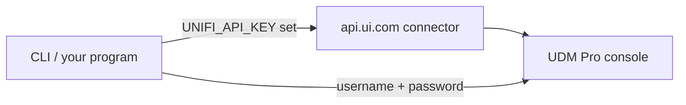

# Alternate: local username/password authentication

**This path is secondary and less exercised than the cloud API key.** gofi's intended,
recommended way to reach a controller is the [cloud API key through the Site Manager
connector](../README.md#step-1--get-a-unifi-api-key-recommended) — it works whether or
not the controller is reachable on your LAN, needs no session cookies, and is what most
of gofi's own testing and day-to-day use goes through. The local path documented here
exists for the case where the controller can't reach `api.ui.com` at all (an isolated
network, a controller with no internet route) or you'd simply rather not create a cloud
key. Expect it to be less battle-tested: fewer of gofi's own test runs and real-world
uses exercise this path, cookie/CSRF session handling has more moving parts than a
static API key, and it depends on the controller being directly reachable in the first
place.

If you're not sure which to use, use the cloud API key. Come back here only if you have
a specific reason not to.

## Setting it up

If the controller is directly reachable and you'd rather use admin credentials, set
these instead of `UNIFI_API_KEY`/`UNIFI_CONSOLE_ID`:

```bash
export UNIFI_USERNAME=admin
export UNIFI_PASSWORD=your-password
export UNIFI_CONTROLLER_IP=192.168.1.1   # optional; used when -H is not given
```

This uses the original cookie/CSRF session flow against the controller directly. It is
fully supported and kicks in automatically whenever `UNIFI_API_KEY` is not set — gofi
checks for an API key first, and only falls back to username/password when none is
present.



If both `UNIFI_API_KEY` and `UNIFI_USERNAME`/`UNIFI_PASSWORD` are set, the API key wins
and gofi prints a note to stderr saying it ignored the username/password pair — it never
silently picks one without telling you.

## gofi CLI: a named local target

For the `gofi` command-line tool specifically, a local controller is usually more
convenient as a named target in `config.toml` than as exported environment variables,
since you can switch between it and a cloud-backed target with `--target`:

```toml
[targets.local-controller]
host             = "192.168.1.1"
site             = "default"
password_command = "pass show unifi/local"
```

```bash
gofi --target local-controller network list
```

See [`docs/gofi-user-guide.md`](gofi-user-guide.md#config--gofis-own-configuration) for
the full config file reference, including how local-mode and connector-mode targets
differ.

## TLS and self-signed certificates

Local controllers commonly serve their web UI with a self-signed certificate. The `gofi`
CLI's `--secure` flag defaults to *off* for exactly this reason — a tool that can't reach
a self-signed local device out of the box is useless — so you don't need to do anything
extra to talk to a controller with a self-signed cert over HTTPS. Pass `--secure` if you
specifically want certificate verification enforced (e.g. the controller has a real CA
certificate and you want gofi to fail loudly if that ever changes).

`--secure` only applies to local-mode targets. It's a usage error (exit code 2) against
a connector-mode target, since connector traffic to `api.ui.com` is always
TLS-verified regardless of any local flag — there's no certificate to skip-verify on a
connection that isn't direct.

## Using local auth from the Go SDK

```go
config := &gofi.Config{
    Host:     "192.168.1.1",
    Port:     443,
    Username: "admin",
    Password: os.Getenv("UNIFI_PASSWORD"),
    Site:     "default",
}
```

For a self-signed certificate in development, either provide your own `tls.Config` for
proper verification, or set `SkipTLSVerify` (development only — this is the library's
equivalent of the CLI's default-off `--secure` posture, except the library defaults to
verifying, so you have to opt in explicitly):

```go
config := &gofi.Config{
    Host:          "192.168.1.1",
    Username:      "admin",
    Password:      os.Getenv("UNIFI_PASSWORD"),
    SkipTLSVerify: true, // development only
}
```

See [Part 2 of the README](../README.md#part-2-using-gofi-in-your-go-program-sdk) for
the API-key equivalent, which is the path most SDK examples in this repo use.
